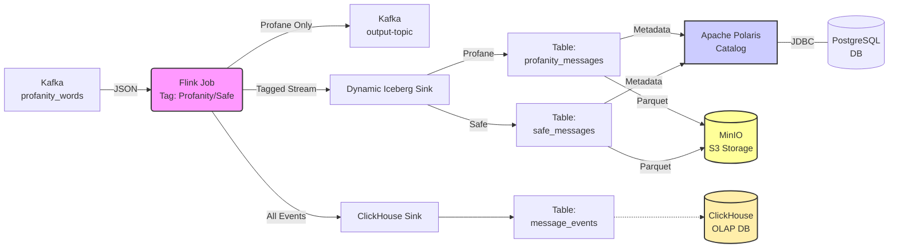
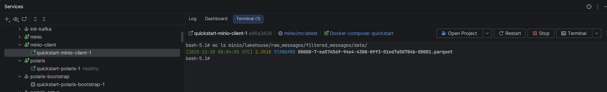
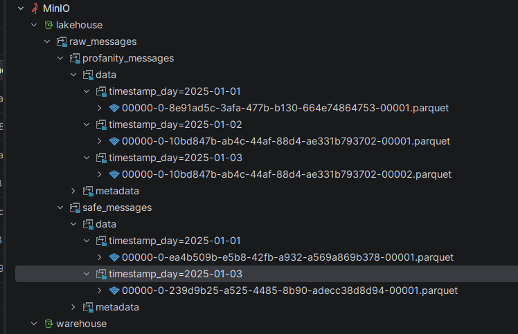

# Flink Streaming to Apache Iceberg via Polaris Catalog

A comprehensive streaming data pipeline that ingests JSON messages from Kafka, identifies profanity content using a dynamic lookup, and writes to Apache Iceberg tables using Polaris REST catalog and MinIO object storage. The pipeline dynamically routes messages to different tables based on their content classification.

---

## Table of Contents

1. [Architecture Overview](#architecture-overview)
2. [Apache Polaris Catalog](#apache-polaris-catalog)
3. [Polaris Setup & Configuration](#polaris-setup--configuration)
4. [Apache Flink Integration](#apache-flink-integration)
5. [Project Structure](#project-structure)
6. [Quick Start](#quick-start)
7. [Testing the Pipeline](#testing-the-pipeline)
8. [Monitoring & Debugging](#monitoring--debugging)
9. [Schema Details](#schema-details)

---

## Architecture Overview



**Components:**
- **Kafka**: Message broker (input: `profanity_words`, output: `output-topic`)
- **Apache Flink 2.1.0**: Stream processing engine with DataStream API
- **Apache Polaris**: Open-source Iceberg REST catalog for metadata management
- **Apache Iceberg 1.10.0**: Table format with ACID guarantees
- **MinIO**: S3-compatible object storage for Iceberg data files
- **PostgreSQL**: Backend database for Polaris catalog metadata
- **ClickHouse**: Real-time OLAP database for fast analytics

---

## Apache Polaris Catalog

### What is Apache Polaris?

**Apache Polaris** is an open-source, vendor-neutral catalog for Apache Iceberg tables. It implements the Iceberg REST Catalog API and provides:

- **Centralized Metadata Management**: Single source of truth for table schemas, partitions, and snapshots
- **Multi-Engine Support**: Works with Flink, Spark, Trino, Dremio, and other query engines
- **ACID Transactions**: Ensures data consistency across concurrent readers/writers
- **OAuth2 Authentication**: Secure access control with token-based authentication
- **Storage Abstraction**: Decouples metadata from storage (S3, HDFS, Azure, GCS)
- **Multi-Tenancy**: Supports multiple catalogs, namespaces, and tables

### Why Use Polaris?

| Feature | Benefit |
|---------|---------|
| **Open Standard** | No vendor lock-in, works with any Iceberg-compatible engine |
| **REST API** | Language-agnostic, easy integration via HTTP |
| **Scalability** | Handles millions of tables and petabytes of data |
| **Time Travel** | Query historical snapshots of tables |
| **Schema Evolution** | Add/remove/rename columns without rewriting data |

---

## Polaris Setup & Configuration

### What you need initially (and why)

To write to an Iceberg table through Polaris, you need **(a)** a durable metadata store, **(b)** a running Polaris REST catalog service, and **(c)** an authenticated identity that can create catalogs/tables and mint OAuth2 tokens.

In this Docker Compose setup that translates to:

1. **PostgreSQL**: the durable persistence layer for Polaris metadata.
2. **`polaris-bootstrap`**: a one-time “admin/bootstrap” step that initializes the DB schema and creates the initial principal.
3. **`polaris`**: the REST catalog server that Flink/Iceberg talks to.
4. **`polaris-setup`**: creates the initial catalog/namespace and the required tables (`profanity_messages` and `safe_messages`).

### 1. PostgreSQL Backend

Polaris stores catalog metadata in PostgreSQL:

```yaml
postgres:
  image: postgres:14.17
  environment:
    POSTGRES_USER: postgres
    POSTGRES_PASSWORD: postgres
    POSTGRES_DB: POLARIS
    POSTGRES_INITDB_ARGS: "--encoding UTF8 --data-checksums"
  command: postgres -c wal_level=logical
  shm_size: 128mb
```

### 2. Polaris Bootstrap

Initializes the Polaris database schema and creates default credentials (`admin`/`password`).

### 3. Automated Catalog Initialization

The `polaris-setup` container automates the creation of catalogs, namespaces, and tables. It now creates two tables to support the routing logic. Both tables are partitioned by `day(timestamp)` to optimize query performance and manage file sizes.

- **`profanity_messages`**: Stores messages identified as containing profanity.
- **`safe_messages`**: Stores clean messages.

Both tables share the same schema, including the `profanity_type` field.

```bash
# Example Payload for Table Creation
{
  "name": "profanity_messages",
  "schema": {
    "type": "struct",
    "fields": [
      {"id": 1, "name": "account_id", "required": false, "type": "string"},
      {"id": 2, "name": "message_id", "required": false, "type": "string"},
      {"id": 3, "name": "message_body", "required": false, "type": "string"},
      {"id": 4, "name": "correlation_id", "required": false, "type": "string"},
      {"id": 5, "name": "message_status", "required": false, "type": "string"},
      {"id": 6, "name": "timestamp", "required": false, "type": "timestamp"},
      {"id": 7, "name": "profanity_type", "required": false, "type": "string"}
    ]
  },
  "spec": {
    "fields": [
      {
        "name": "timestamp_day",
        "transform": "day",
        "source-id": 6
      }
    ]
  }
}
```

---

## ClickHouse Setup & Configuration

### 1. ClickHouse Service
ClickHouse runs as a single-node instance (`clickhouse:25.3`) with HTTP (8123) and Native (9000) ports exposed.

### 2. Automated Initialization
The `clickhouse-setup` service waits for ClickHouse to be healthy and automatically creates the target table.

```sql
CREATE TABLE IF NOT EXISTS default.message_events
(
    account_id       String,
    message_id       String,
    message_body     String,
    correlation_id   String,
    message_status   String,
    event_time       DateTime64(3),
    profanity_type   String,
    inserted_at      DateTime64(3) DEFAULT now()
)
ENGINE = ReplacingMergeTree(inserted_at)
PARTITION BY toYYYYMM(event_time)
ORDER BY (account_id, message_id);
```

### 3. Materialized Insertion Time
The `inserted_at` column is populated via `DEFAULT now()` (or `MATERIALIZED now()` in setup) to allow `ReplacingMergeTree` to handle deduplication based on the latest insertion time.

---

## Apache Flink Integration

### 1. Flink Job Overview

The Flink job reads JSON messages from Kafka, checks for profanity against a dynamically loaded list, tags the message, and routes it to the appropriate destination.

**Pipeline Stages:**
1. **Source**: Kafka topic `profanity_words` with JSON deserialization.
2. **Watermarking**: Event-time processing with 10-second bounded out-of-orderness.
3. **Tagging**: 
   - Loads profanity list from `src/main/resources/profanity_list.txt`.
   - Checks `message_body` against the list.
   - Sets `profanity_type` to `PROFANITY` or `SAFE`.
4. **Sinks**:
   - **Kafka sink**: `output-topic` (only for messages with `profanity_type=PROFANITY`).
   - **Dynamic Iceberg Sink**: Routes to `profanity_messages` or `safe_messages` tables in Polaris based on `profanity_type`.
   - **ClickHouse Sink**: Writes all messages to `message_events` table via Async Sink (RowBinary format).

### 2. Profanity Lookup & Tagging

The job loads a list of profane words from a file and uses it to tag messages.

```java
// Load profanity list
Set<String> profanities = loadProfanities();

// Tag messages
SingleOutputStreamOperator<MessageEvent> processedStream = stream.map(event -> {
    boolean isProfane = containsProfanity(event.getMessageBody(), profanities);
    event.setProfanityType(isProfane ? MessageEvent.ProfanityType.PROFANITY : MessageEvent.ProfanityType.SAFE);
    return event;
});
```

### 3. Dynamic Iceberg Sink Routing

The project uses a custom `IcebergSinkFunction` that implements dynamic routing logic and partitioning.

```java
// Define Partition Spec
PartitionSpec partitionSpec = PartitionSpec.builderFor(FILTERED_MESSAGE_SCHEMA)
    .day("timestamp")
    .build();

DynamicIcebergSink.Builder<RowData> builder = DynamicIcebergSink.forInput(rowDataStream)
  .generator((row, out) -> {
    String profanityType = row.getString(6).toString();
    String tableName = "safe_messages";
    if ("PROFANITY".equals(profanityType)) {
      tableName = "profanity_messages";
    }
    out.collect(
      new DynamicRecord(
        TableIdentifier.of(namespace, tableName),
        branch,
        FILTERED_MESSAGE_SCHEMA,
        row,
        partitionSpec,
        DistributionMode.HASH,
        1
      )
    );
  })
  // ... configuration ...
```

This ensures that `PROFANITY` messages go to the `profanity_messages` table and everything else goes to `safe_messages`.

### 4. Checkpointing Configuration

Ensures exactly-once processing semantics and controls file commit frequency (Iceberg commits on checkpoint):

```java
env.enableCheckpointing(300000);  // Every 5 minutes
CheckpointConfig checkpointConfig = env.getCheckpointConfig();
checkpointConfig.setCheckpointingConsistencyMode(CheckpointingMode.EXACTLY_ONCE);
```

---

## Project Structure

```
quickstart/
├── src/main/java/org/myorg/quickstart/
│   ├── job/
│   │   └── DataStreamJob.java          # Main Flink job entry point
│   ├── model/
│   │   └── MessageEvent.java           # POJO with ProfanityType enum
│   ├── sink/
│   │   ├── IcebergSinkFunction.java             # Dynamic Iceberg sink with routing logic
│   │   ├── DataToRowConverter.java              # Converts POJO to RowData
│   │   ├── MessageEventClickHouseConverter.java # POJO to ClickHouse RowBinary
│   │   └── ClickHouseSinkFactory.java           # Configures Async Sink
├── src/main/resources/
│   └── profanity_list.txt              # List of profanity words
├── pom.xml                             # Maven dependencies
├── docker-compose.yml                  # Multi-container orchestration
├── Dockerfile                          # Flink job image with dependencies
└── README.md                           # This file
```

---

## Quick Start

### Prerequisites

- **Docker** 20.10+
- **Docker Compose** 1.29+
- **Maven** 3.6+
- **Java** 11

### Step 1: Build the Flink Job

```bash
mvn clean package -DskipTests
```

This creates `target/quickstart-0.1.jar`.

### Step 2: Start the Infrastructure

```bash
docker-compose up -d
```

**Startup Sequence:**
1. Postgres -> Polaris -> MinIO -> ClickHouse
2. Kafka -> init-kafka
3. polaris-setup (creates catalog, namespace, `profanity_messages`, `safe_messages`)
4. clickhouse-setup (creates `message_events` table)
5. Flink Job

### Step 3: View Logs

```bash
docker logs -f jobmanager
docker logs -f polaris-setup
docker logs -f clickhouse-setup
```

---

## Testing the Pipeline

### 1. Produce Test Messages

**Case A: Profane Message**
```bash
docker exec -it broker bash

kafka-console-producer --broker-list broker:29092 --topic profanity_words << EOF
{"account_id":"1","message_id":"100","message_body":"This is a gun related message","correlation_id":"A1","message_status":"new","timestamp":"2025-01-01T10:00:00Z"}
EOF
```

**Case B: Safe Message**
```bash
kafka-console-producer --broker-list broker:29092 --topic profanity_words << EOF
{"account_id":"2","message_id":"101","message_body":"Hello world, this is safe","correlation_id":"B1","message_status":"new","timestamp":"2025-01-01T10:05:00Z"}
EOF
```

### 2. Verify Output

**Kafka Output Topic (Profane Only):**
```bash
kafka-console-consumer --bootstrap-server broker:29092 --topic output-topic --from-beginning
```
*Expected: Should show the "gun" message, but NOT the "Hello world" message.*

**Polaris/Iceberg Verification:**

You can query the Polaris API to check if data files are added to the respective tables.

**Check `profanity_messages`:**
```bash
# Get OAuth Token
TOKEN=$(curl -s -X POST http://localhost:8181/api/catalog/v1/oauth/tokens \
  -d 'grant_type=client_credentials&client_id=admin&client_secret=password&scope=PRINCIPAL_ROLE:ALL' \
  | jq -r '.access_token')

# Check Table Metadata
curl -s "http://localhost:8181/api/catalog/v1/lakehouse/namespaces/raw_messages/tables/profanity_messages" \
  -H "Authorization: Bearer $TOKEN" | jq '.metadata."current-snapshot-id"'
```

**Check `safe_messages`:**
```bash
curl -s "http://localhost:8181/api/catalog/v1/lakehouse/namespaces/raw_messages/tables/safe_messages" \
  -H "Authorization: Bearer $TOKEN" | jq '.metadata."current-snapshot-id"'
```

**MinIO Console:**
Navigate to `http://localhost:9001` (admin/password).
- `lakehouse/raw_messages/profanity_messages/data/`: Should contain parquet files for profane messages.
- `lakehouse/raw_messages/safe_messages/data/`: Should contain parquet files for safe messages.



**Expected Structure:**

If you use Big Data tools plugin from IntelliJ and connect to MinIO,
you can browse the data files directly in the UI:


**ClickHouse Verification:**

You can check the `message_events` table in ClickHouse (via HTTP or Native client):

```sql
-- Count total events
SELECT count() FROM default.message_events;

-- View latest 5 events
SELECT * FROM default.message_events ORDER BY event_time DESC LIMIT 5;

-- Check profanity statistics
SELECT profanity_type, count() FROM default.message_events GROUP BY profanity_type;
```

---

## Schema Details

### Output Schema (Both Tables)

| Column Name | Type | Description |
|-------------|------|-------------|
| `account_id` | string | User account identifier |
| `message_id` | string | Unique message identifier |
| `message_body` | string | Message text content |
| `correlation_id` | string | Request correlation ID |
| `message_status` | string | Message delivery status |
| `timestamp` | timestamp | Event timestamp |
| `profanity_type` | string | `PROFANITY` or `SAFE` |

---

## Environment Variables

### Flink Job Configuration

| Variable | Default | Description |
|----------|---------|-------------|
| `KAFKA_BOOTSTRAP_SERVERS` | `broker:29092` | Kafka broker addresses |
| `POLARIS_URI` | `http://polaris:8181/api/catalog` | Polaris REST endpoint |
| `CATALOG_NAME` | `polaris` | Catalog name in Flink |
| `ICEBERG_NAMESPACE` | `raw_messages` | Namespace within catalog |
| `WRITE_PARALLELISM` | `1` | Number of Iceberg writer tasks |
| `CHECKPOINT_INTERVAL` | `300000` | Flink checkpoint interval in ms (5 mins) |
| `ICEBERG_TARGET_FILE_SIZE_BYTES` | `134217728` | Target Iceberg file size (128MB) |
| `ICEBERG_DISTRIBUTION_MODE` | `HASH` | Distribution mode (HASH, NONE, RANGE) |
| `CLICKHOUSE_JDBC_URL` | `http://clickhouse:8123` | ClickHouse HTTP endpoint |
| `CLICKHOUSE_USER` | `default` | ClickHouse user |
| `CLICKHOUSE_PASSWORD` | `password` | ClickHouse password |
| `CLICKHOUSE_DATABASE` | `default` | ClickHouse database |
| `CLICKHOUSE_TABLE` | `message_events` | ClickHouse table name |

---
