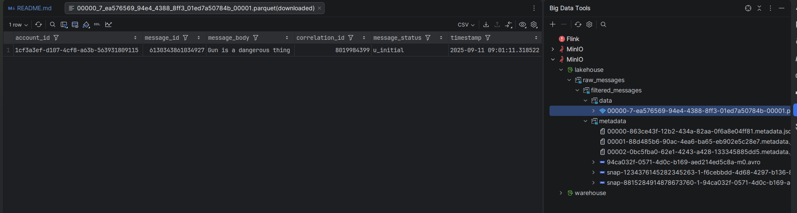

# Flink Streaming to Apache Iceberg via Polaris Catalog

A comprehensive streaming data pipeline that ingests JSON messages from Kafka, filters profanity content, and writes to Apache Iceberg tables using Polaris REST catalog and MinIO object storage.

---

## Table of Contents

1. [Architecture Overview](#architecture-overview)
2. [Apache Polaris Catalog](#apache-polaris-catalog)
3. [Polaris Setup & Configuration](#polaris-setup--configuration)
4. [Apache Flink Integration](#apache-flink-integration)
5. [Project Structure](#project-structure)
6. [Quick Start](#quick-start)
7. [Testing the Pipeline](#testing-the-pipeline)
8. [Monitoring & Debugging](#monitoring--debugging)
9. [Schema Details](#schema-details)

---

## Architecture Overview

```
┌─────────────┐      ┌──────────────┐      ┌─────────────┐
│   Kafka     │─────▶│  Flink Job   │─────▶│   Kafka     │
│ (profanity_ │      │  (Filter by  │      │ (output-    │
│   words)    │      │   "gun")     │      │   topic)    │
└─────────────┘      └──────┬───────┘      └─────────────┘
                             │
                             ▼
                     ┌───────────────┐
                     │  Iceberg Sink │
                     └───────┬───────┘
                             │
                ┌────────────┴──────────────┐
                ▼                           ▼
        ┌──────────────┐          ┌─────────────┐
        │   Polaris    │          │    MinIO    │
        │  (Catalog    │◀────────▶│ (S3 Storage)│
        │  Metadata)   │          └─────────────┘
        └──────────────┘
                ▲
                │
        ┌───────────────┐
        │  PostgreSQL   │
        │  (Polaris DB) │
        └───────────────┘
```

**Components:**
- **Kafka**: Message broker (input: `profanity_words`, output: `output-topic`)
- **Apache Flink 2.1.0**: Stream processing engine with DataStream API
- **Apache Polaris**: Open-source Iceberg REST catalog for metadata management
- **Apache Iceberg 1.10.0**: Table format with ACID guarantees
- **MinIO**: S3-compatible object storage for Iceberg data files
- **PostgreSQL**: Backend database for Polaris catalog metadata

---

## Apache Polaris Catalog

### What is Apache Polaris?

**Apache Polaris** is an open-source, vendor-neutral catalog for Apache Iceberg tables. It implements the Iceberg REST Catalog API and provides:

- **Centralized Metadata Management**: Single source of truth for table schemas, partitions, and snapshots
- **Multi-Engine Support**: Works with Flink, Spark, Trino, Dremio, and other query engines
- **ACID Transactions**: Ensures data consistency across concurrent readers/writers
- **OAuth2 Authentication**: Secure access control with token-based authentication
- **Storage Abstraction**: Decouples metadata from storage (S3, HDFS, Azure, GCS)
- **Multi-Tenancy**: Supports multiple catalogs, namespaces, and tables

### Why Use Polaris?

| Feature | Benefit |
|---------|---------|
| **Open Standard** | No vendor lock-in, works with any Iceberg-compatible engine |
| **REST API** | Language-agnostic, easy integration via HTTP |
| **Scalability** | Handles millions of tables and petabytes of data |
| **Time Travel** | Query historical snapshots of tables |
| **Schema Evolution** | Add/remove/rename columns without rewriting data |

### Polaris vs Other Catalogs

| Catalog Type | Examples | Use Case |
|--------------|----------|----------|
| **Hive Metastore** | Apache Hive | Legacy systems, Hadoop ecosystems |
| **AWS Glue** | AWS Glue Data Catalog | AWS-native, tight integration with EMR/Athena |
| **Polaris** | Apache Polaris | Cloud-agnostic, modern REST API, multi-engine |
| **Nessie** | Project Nessie | Git-like branching for data lakes |

---

## Polaris Setup & Configuration

### What you need initially (and why)

To write to an Iceberg table through Polaris, you need **(a)** a durable metadata store, **(b)** a running Polaris REST catalog service, and **(c)** an authenticated identity that can create catalogs/tables and mint OAuth2 tokens.

In this Docker Compose setup that translates to:

1. **PostgreSQL**: the durable persistence layer for Polaris metadata.
2. **`polaris-bootstrap`**: a one-time “admin/bootstrap” step that initializes the DB schema and creates the initial principal (so you can authenticate).
3. **`polaris`**: the REST catalog server that Flink/Iceberg talks to.
4. **`polaris-setup`** (recommended): creates the initial catalog/namespace/table so the Flink job can append immediately.

Polaris is configured with `POLARIS_PERSISTENCE_TYPE=relational-jdbc` because a relational DB via JDBC is the most practical baseline for a quickstart:

- **Durable across restarts**: table metadata survives container restarts.
- **Operationally simple**: one Postgres container.
- **Production-like**: a relational backend is a common production catalog persistence option.

### 1. PostgreSQL Backend

Polaris stores catalog metadata in PostgreSQL:

```yaml
postgres:
  image: postgres:14.17
  environment:
    POSTGRES_USER: postgres
    POSTGRES_PASSWORD: postgres
    POSTGRES_DB: POLARIS
    POSTGRES_INITDB_ARGS: "--encoding UTF8 --data-checksums"
  command: postgres -c wal_level=logical
  shm_size: 128mb
```

**Key Configurations:**
- `wal_level=logical`: Enables logical replication for change data capture
- `shm_size=128mb`: Shared memory for efficient query processing
- `data-checksums`: Detects data corruption

### 2. Polaris Bootstrap

Initializes the Polaris database schema and creates default credentials:

```yaml
polaris-bootstrap:
  image: apache/polaris-admin-tool:latest
  command:
    - "bootstrap"
    - "--realm=default"
    - "--credential=default,admin,password"
  environment:
    POLARIS_PERSISTENCE_TYPE: relational-jdbc
    QUARKUS_DATASOURCE_JDBC_URL: jdbc:postgresql://postgres:5432/POLARIS
```

**What it does:**
1. Creates necessary database tables (`catalogs`, `namespaces`, `tables`, `principals`)
2. Registers the `default` realm
3. Creates the `admin` principal with password `password`

**Why the bootstrap/admin step is required:**

- Polaris uses **principals** and **principal roles** for identity and authorization.
- Both the `polaris-setup` automation and the Flink job rely on **OAuth2 client-credentials** (`client_id:client_secret`) to obtain a bearer token (see the `oauth/tokens` call in the next section).
- Without bootstrap, there is no initial principal to authenticate with, and therefore no way to create the catalog/namespace/table or for Flink to obtain tokens.

### 3. Polaris Service

Runs the REST catalog server:

```yaml
polaris:
  image: apache/polaris:latest
  ports:
    - "8181:8181"  # REST Catalog API
    - "8182:8182"  # Management API
  environment:
    # Database connection
    POLARIS_PERSISTENCE_TYPE: relational-jdbc
    QUARKUS_DATASOURCE_JDBC_URL: jdbc:postgresql://postgres:5432/POLARIS

    # Retry configuration
    POLARIS_PERSISTENCE_RELATIONAL_JDBC_MAX_RETRIES: 5
    POLARIS_PERSISTENCE_RELATIONAL_JDBC_INITIAL_DELAY_IN_MS: 100

    # S3/MinIO credentials
    AWS_ACCESS_KEY_ID: admin
    AWS_SECRET_ACCESS_KEY: password
    AWS_ENDPOINT_URL_S3: http://minio:9000

    # Authentication
    POLARIS_BOOTSTRAP_CREDENTIALS: default,admin,password
```

**Key Endpoints:**
- `http://localhost:8181/api/catalog/v1`: Iceberg REST API (used by Flink)
- `http://localhost:8181/api/management/v1`: Admin operations (create catalogs, namespaces)
- `http://localhost:8182/q/health`: Health check endpoint

Practically:

- **Flink + Iceberg** use the catalog REST API to load table metadata and commit writes.
- **Setup/admin automation** uses the management API to create catalogs and uses the OAuth2 token endpoint (`/api/catalog/v1/oauth/tokens`) to authenticate.

### 4. Automated Catalog Initialization

The `polaris-setup` container automates the creation of catalogs, namespaces, and tables:

```bash
# 1. Obtain OAuth2 token
TOKEN=$(curl -X POST http://polaris:8181/api/catalog/v1/oauth/tokens \
  -d "grant_type=client_credentials&client_id=admin&client_secret=password&scope=PRINCIPAL_ROLE:ALL" \
  | jq -r '.access_token')

# 2. Create catalog
curl -X POST http://polaris:8181/api/management/v1/catalogs \
  -H "Authorization: Bearer $TOKEN" \
  -d '{
    "catalog": {
      "name": "lakehouse",
      "type": "INTERNAL",
      "properties": {"default-base-location": "s3://lakehouse"},
      "storageConfigInfo": {
        "storageType": "S3",
        "allowedLocations": ["s3://lakehouse/*"],
        "endpoint": "http://minio:9000",
        "pathStyleAccess": true
      }
    }
  }'

# 3. Create namespace
curl -X POST http://polaris:8181/api/catalog/v1/lakehouse/namespaces \
  -H "Authorization: Bearer $TOKEN" \
  -d '{"namespace": ["raw_messages"]}'

# 4. Create table
curl -X POST http://polaris:8181/api/catalog/v1/lakehouse/namespaces/raw_messages/tables \
  -H "Authorization: Bearer $TOKEN" \
  -d '{
    "name": "filtered_messages",
    "schema": {
      "type": "struct",
      "fields": [
        {"id": 1, "name": "account_id", "required": false, "type": "string"},
        {"id": 2, "name": "message_id", "required": false, "type": "string"},
        {"id": 3, "name": "message_body", "required": false, "type": "string"},
        {"id": 4, "name": "correlation_id", "required": false, "type": "string"},
        {"id": 5, "name": "message_status", "required": false, "type": "string"},
        {"id": 6, "name": "timestamp", "required": false, "type": "timestamptz"}
      ]
    }
  }'
```

**Result:**
- **Catalog**: `lakehouse` (stored in MinIO at `s3://lakehouse`)
- **Namespace**: `raw_messages`
- **Table**: `filtered_messages` with 6 fields

### 5. MinIO Storage Configuration

MinIO provides S3-compatible storage for Iceberg data files:

```yaml
minio:
  image: minio/minio:latest
  environment:
    MINIO_ROOT_USER: admin
    MINIO_ROOT_PASSWORD: password
  command: ["server", "/data", "--console-address", ":9001"]
  ports:
    - "9000:9000"  # S3 API
    - "9001:9001"  # Web Console

minio-client:
  image: minio/mc:latest
  entrypoint: >
    /bin/sh -c "
      mc alias set minio http://minio:9000 admin password;
      mc mb minio/lakehouse;
      mc mb minio/warehouse;
      mc anonymous set public minio/lakehouse;
      mc anonymous set public minio/warehouse;
    "
```

**Buckets Created:**
- `lakehouse`: Stores Iceberg data files (Parquet) and metadata (JSON)
- `warehouse`: Additional storage for multi-table setups

---

## Apache Flink Integration

### 1. Flink Job Overview

The Flink job reads JSON messages from Kafka, filters messages containing "gun", and writes to both Kafka and Iceberg:

**Pipeline Stages:**
1. **Source**: Kafka topic `profanity_words` with JSON deserialization
2. **Watermarking**: Event-time processing with 10-second bounded out-of-orderness
3. **Filtering**: Select messages where `message_body` contains "gun"
4. **Dual Sinks**:
   - Kafka sink → `output-topic` (for real-time consumers)
   - Iceberg sink → Polaris catalog (for analytics)

### 2. Kafka Source Configuration

```java
JsonDeserializationSchema<MessageEvent> deserializer =
    new JsonDeserializationSchema<>(MessageEvent.class);

KafkaSource<MessageEvent> source = KafkaSource.<MessageEvent>builder()
    .setBootstrapServers("broker:29092")
    .setTopics("profanity_words")
    .setGroupId("flink-test")
    .setStartingOffsets(OffsetsInitializer.earliest())
    .setValueOnlyDeserializer(deserializer)
    .setProperty("acks", "all")
    .build();
```

**Input Schema (MessageEvent.java):**
```java
public class MessageEvent {
    @JsonProperty("account_id")
    private String accountId;

    @JsonProperty("message_id")
    private String messageId;

    @JsonProperty("message_body")
    private String messageBody;

    @JsonProperty("correlation_id")
    private String correlationId;

    @JsonProperty("message_status")
    private String messageStatus;

    @JsonProperty("timestamp")
    private String timestamp;  // ISO-8601 format
}
```

### 3. Watermark Strategy

Handles out-of-order events using event-time semantics:

```java
WatermarkStrategy<MessageEvent> watermarkStrategy = WatermarkStrategy
    .<MessageEvent>forBoundedOutOfOrderness(Duration.ofSeconds(10))
    .withTimestampAssigner((event, recordTimestamp) -> {
        String timestampStr = event.getTimestamp();
        return Instant.parse(timestampStr).toEpochMilli();
    });
```

**Why 10 seconds?**
- Allows late-arriving events up to 10 seconds to be processed
- Balances latency vs completeness
- Adjust based on your data's lateness characteristics

### 4. Filtering Logic

Simple case-insensitive profanity check:

```java
SingleOutputStreamOperator<MessageEvent> filtered = stream
    .filter(msg -> msg.getMessageBody().toLowerCase().contains("gun"));
```

### 5. Iceberg Sink Configuration

Connects to Polaris catalog and writes Parquet files to MinIO:

```java
Map<String, String> catalogProps = new HashMap<>();
catalogProps.put("uri", "http://polaris:8181/api/catalog");
catalogProps.put("credential", "admin:password");
catalogProps.put("warehouse", "lakehouse");
catalogProps.put("scope", "PRINCIPAL_ROLE:ALL");
catalogProps.put("rest.auth.type", "oauth2");
catalogProps.put("oauth2-server-uri", "http://polaris:8181/api/catalog/v1/oauth/tokens");
catalogProps.put("s3.endpoint", "http://minio:9000");
catalogProps.put("s3.access-key-id", "admin");
catalogProps.put("s3.secret-access-key", "password");
catalogProps.put("s3.path-style-access", "true");
catalogProps.put("client.region", "us-east-1");
catalogProps.put("io-impl", "org.apache.iceberg.aws.s3.S3FileIO");

DataStream<RowData> icebergRowStream = toRowDataStream(filtered);
createIcebergSinkBuilder(
    icebergRowStream,
    "polaris",              // catalog name
    "raw_messages",         // namespace
    "main",                 // branch
    catalogProps,
    1                       // write parallelism
).append();
```

**Key Properties:**
- `rest.auth.type=oauth2`: Use OAuth2 token-based authentication
- `s3.path-style-access=true`: Required for MinIO (uses `http://minio:9000/bucket/key` format)
- `io-impl`: S3FileIO for reading/writing files to S3-compatible storage

#### Why a “dynamic sink” (`DynamicIcebergSink`)

This project uses Iceberg’s **DataStream dynamic sink** (implemented in `src/main/java/org/myorg/quickstart/sink/IcebergSinkFunction.java`).

The key idea is that the sink consumes `DynamicRecord`s, where each record can carry:

- the target `TableIdentifier` (which table to write to),
- the target branch (e.g., `main`),
- the Iceberg `Schema`/`PartitionSpec` alongside the `RowData`.

In the current quickstart we always route to `filtered_messages`, so it behaves like a single-table sink, but choosing the dynamic sink makes it easy to extend later to **route different events to different tables** (multi-tenant, message-type-based routing, etc.) without changing the pipeline structure.

### 6. Checkpointing Configuration

Ensures exactly-once processing semantics:

```java
env.enableCheckpointing(30000);  // Every 30 seconds

CheckpointConfig checkpointConfig = env.getCheckpointConfig();
checkpointConfig.setCheckpointingConsistencyMode(CheckpointingMode.EXACTLY_ONCE);
checkpointConfig.setMinPauseBetweenCheckpoints(30000);
checkpointConfig.setCheckpointTimeout(600000);  // 10 minutes
checkpointConfig.setMaxConcurrentCheckpoints(1);
checkpointConfig.setTolerableCheckpointFailureNumber(3);
```

**State Backend:**
- **RocksDB**: Handles large state (GB-scale)
- Stored in `/tmp/checkpoints` (configure for production to use S3/HDFS)

---

## Project Structure

```
quickstart/
├── src/main/java/org/myorg/quickstart/
│   ├── job/
│   │   └── DataStreamJob.java          # Main Flink job entry point
│   ├── model/
│   │   └── MessageEvent.java           # POJO for JSON deserialization
│   ├── sink/
│   │   └── IcebergSinkFunction.java    # Iceberg sink builder & RowData converter
│   └── schema/
│       └── IcebergSchemas.java         # Iceberg table schema definitions
├── pom.xml                              # Maven dependencies
├── docker-compose.yml                   # Multi-container orchestration
├── Dockerfile                           # Flink job image with dependencies
└── README.md                            # This file
```

---

## Quick Start

### Prerequisites

- **Docker** 20.10+
- **Docker Compose** 1.29+
- **Maven** 3.6+
- **Java** 11

### Step 1: Build the Flink Job

```bash
mvn clean package -DskipTests
```

This creates `target/quickstart-0.1.jar` containing your Flink job and all dependencies.

### Step 2: Start the Infrastructure

```bash
docker-compose up -d
```

**Startup Sequence:**
1. PostgreSQL → Polaris Bootstrap → Polaris → MinIO
2. Kafka (Zookeeper + Broker) → init-kafka (create topics)
3. polaris-setup (create catalog/namespace/table)
4. Flink JobManager + TaskManager

**Verify Startup:**
```bash
# Check Polaris health
curl http://localhost:8182/q/health

# Check Flink dashboard
open http://localhost:8081

# Check MinIO console
open http://localhost:9001  # Login: admin/password
```

### Step 3: View Logs

```bash
# Watch Polaris setup
docker logs -f polaris-setup

# Watch Flink job
docker logs -f jobmanager

# Watch Kafka topics
docker logs -f init_kafka
```

---

## Testing the Pipeline

### 1. Produce Test Messages

Create a sample JSON message:

```json
{
  "account_id": "1cf3a3ef-d107-4cf8-a63b-563931809115",
  "message_id": "6130343861034927",
  "message_body": "Gun is a dangerous thing",
  "correlation_id": "8019984399",
  "message_status": "u_initial",
  "timestamp": "2025-09-11T09:01:11.318522Z"
}
```

**Send to Kafka:**

```bash
docker exec -it broker bash

# Produce message to profanity_words topic
kafka-console-producer --broker-list broker:29092 --topic profanity_words << EOF
{"account_id":"1cf3a3ef-d107-4cf8-a63b-563931809115","message_id":"6130343861034927","message_body":"Gun is a dangerous thing","correlation_id":"8019984399","message_status":"u_initial","timestamp":"2025-09-11T09:01:11.318522Z"}
EOF
```

### 2. Verify Kafka Output

Check the filtered message in `output-topic`:

```bash
kafka-console-consumer --bootstrap-server broker:29092 \
  --topic output-topic \
  --from-beginning
```

**Expected Output:**
```json
{"account_id":"1cf3a3ef-d107-4cf8-a63b-563931809115","message_id":"6130343861034927","message_body":"Gun is a dangerous thing","correlation_id":"8019984399","message_status":"u_initial","timestamp":"2025-09-11T09:01:11.318522Z"}
```

### 3. Verify Iceberg Table

**Query using Polaris REST API:**

```bash
# Get table metadata
curl -s "http://localhost:8181/api/catalog/v1/lakehouse/namespaces/raw_messages/tables/filtered_messages" \
  -H "Authorization: Bearer $(curl -s -X POST http://localhost:8181/api/catalog/v1/oauth/tokens \
    -d 'grant_type=client_credentials&client_id=admin&client_secret=password&scope=PRINCIPAL_ROLE:ALL' \
    | jq -r '.access_token')" \
  | jq '.'
```
**Expected Structure:**
```json
{
  "metadata-location": "s3://lakehouse/raw_messages/filtered_messages/metadata/00002-0bc5fba0-62e1-4243-a428-133345885dd5.metadata.json",
  "metadata": {
    "format-version": 2,
    "table-uuid": "1d7822a6-fd5e-4df8-8a6d-77becb19be3e",
    "location": "s3://lakehouse/raw_messages/filtered_messages",
    "last-sequence-number": 2,
    "last-updated-ms": 1766217845515,
    "last-column-id": 6,
    "current-schema-id": 0,
    "schemas": [
      {
        "type": "struct",
        "schema-id": 0,
        "fields": [
          {
            "id": 1,
            "name": "account_id",
            "required": false,
            "type": "string"
          },
          {
            "id": 2,
            "name": "message_id",
            "required": false,
            "type": "string"
          },
          {
            "id": 3,
            "name": "message_body",
            "required": false,
            "type": "string"
          },
          {
            "id": 4,
            "name": "correlation_id",
            "required": false,
            "type": "string"
          },
          {
            "id": 5,
            "name": "message_status",
            "required": false,
            "type": "string"
          },
          {
            "id": 6,
            "name": "timestamp",
            "required": false,
            "type": "timestamptz"
          }
        ]
      }
    ],
    "default-spec-id": 0,
    "partition-specs": [
      {
        "spec-id": 0,
        "fields": []
      }
    ],
    "last-partition-id": 999,
    "default-sort-order-id": 0,
    "sort-orders": [
      {
        "order-id": 0,
        "fields": []
      }
    ],
    "properties": {
      "created-at": "2025-12-20T08:03:31.826508830Z",
      "write.parquet.compression-codec": "zstd"
    },
    "current-snapshot-id": 8815284914878673760,
    "refs": {
      "main": {
        "snapshot-id": 8815284914878673760,
        "type": "branch"
      }
    },
    "snapshots": [
      {
        "sequence-number": 1,
        "snapshot-id": 1234376145282345263,
        "timestamp-ms": 1766217834181,
        "summary": {
          "operation": "append",
          "changed-partition-count": "0",
          "total-records": "0",
          "total-files-size": "0",
          "total-data-files": "0",
          "total-delete-files": "0",
          "total-position-deletes": "0",
          "total-equality-deletes": "0",
          "iceberg-version": "Apache Iceberg 1.10.0 (commit 2114bf631e49af532d66e2ce148ee49dd1dd1f1f)"
        },
        "manifest-list": "s3://lakehouse/raw_messages/filtered_messages/metadata/snap-1234376145282345263-1-f6cebbdd-4d68-4297-b136-8a98cabf8ac9.avro",
        "schema-id": 0
      },
      {
        "sequence-number": 2,
        "snapshot-id": 8815284914878673760,
        "parent-snapshot-id": 1234376145282345263,
        "timestamp-ms": 1766217845515,
        "summary": {
          "operation": "overwrite",
          "flink.operator-id": "13ec98479df712dc320cd8c20a3a4d6e",
          "flink.job-id": "28ea9faa0b0381fa8d862af1e1d7381d",
          "flink.max-committed-checkpoint-id": "1",
          "added-data-files": "1",
          "added-records": "1",
          "added-files-size": "2390",
          "changed-partition-count": "1",
          "total-records": "1",
          "total-files-size": "2390",
          "total-data-files": "1",
          "total-delete-files": "0",
          "total-position-deletes": "0",
          "total-equality-deletes": "0",
          "iceberg-version": "Apache Iceberg 1.10.0 (commit 2114bf631e49af532d66e2ce148ee49dd1dd1f1f)"
        },
        "manifest-list": "s3://lakehouse/raw_messages/filtered_messages/metadata/snap-8815284914878673760-1-94ca032f-0571-4d0c-b169-aed214ed5c8a.avro",
        "schema-id": 0
      }
    ],
    "statistics": [],
    "partition-statistics": [],
    "snapshot-log": [
      {
        "timestamp-ms": 1766217834181,
        "snapshot-id": 1234376145282345263
      },
      {
        "timestamp-ms": 1766217845515,
        "snapshot-id": 8815284914878673760
      }
    ],
    "metadata-log": [
      {
        "timestamp-ms": 1766217811852,
        "metadata-file": "s3://lakehouse/raw_messages/filtered_messages/metadata/00000-863ce43f-12b2-434a-82aa-0f6a8e04ff81.metadata.json"
      },
      {
        "timestamp-ms": 1766217834181,
        "metadata-file": "s3://lakehouse/raw_messages/filtered_messages/metadata/00001-88d485b6-90ac-4ea6-ba65-eb902e5c28e7.metadata.json"
      }
    ]
  },
  "config": {
    "s3.path-style-access": "true",
    "s3.endpoint": "http://minio:9000"
  }
}
```

**Check MinIO for data files:**

```bash
# List files in lakehouse bucket
docker exec minio-client mc ls minio/lakehouse/raw_messages/filtered_messages/data/
```


**Expected Structure:**

If you use Big Data tools plugin from IntelliJ and connect to MinIO,
you can browse the data files directly in the UI:

```
lakehouse/
└── raw_messages/
    └── filtered_messages/
        ├── metadata/
        │   ├── v1.metadata.json
        │   └── snap-*.avro
        └── data/
            └── *.parquet
```

### 4. Advanced Testing: Negative Case

Send a message **without** profanity:

```bash
kafka-console-producer --broker-list broker:29092 --topic profanity_words << EOF
{"account_id":"test-123","message_id":"999","message_body":"Hello world","correlation_id":"abc","message_status":"sent","timestamp":"2025-09-11T10:00:00Z"}
EOF
```

**Result:**
- ❌ Message NOT written to `output-topic`
- ❌ Message NOT written to Iceberg table
- ✅ Filtered out by Flink job

---

## Monitoring & Debugging

### Flink Dashboard

Access at `http://localhost:8081`

**Key Metrics:**
- **Records Sent** (source): Total messages read from Kafka
- **Records Filtered** (filter operator): Messages matching "gun"
- **Records Written** (Iceberg sink): Committed to Polaris catalog
- **Checkpoints**: View checkpoint history and state size
- **Backpressure**: Identify slow operators

### Polaris Catalog Inspection

**List all tables:**
```bash
TOKEN=$(curl -s -X POST http://localhost:8181/api/catalog/v1/oauth/tokens \
  -d 'grant_type=client_credentials&client_id=admin&client_secret=password&scope=PRINCIPAL_ROLE:ALL' \
  | jq -r '.access_token')

curl -s "http://localhost:8181/api/catalog/v1/lakehouse/namespaces/raw_messages/tables" \
  -H "Authorization: Bearer $TOKEN" | jq '.identifiers[].name'
```

**Get table history:**
```bash
curl -s "http://localhost:8181/api/catalog/v1/lakehouse/namespaces/raw_messages/tables/filtered_messages" \
  -H "Authorization: Bearer $TOKEN" \
  | jq '.metadata."current-snapshot-id"'
```

### MinIO Console

Access at `http://localhost:9001` (admin/password)

**Navigate to:**
- `lakehouse` bucket → `raw_messages/filtered_messages/data/` → View Parquet files

### Common Issues

| Issue | Cause | Solution |
|-------|-------|----------|
| **Job fails with `NoSuchMethodError: timestampNanos()`** | Avro version conflict | Add `avro-1.12.0` dependency to `pom.xml` |
| **Checkpoint failures** | Permission issues on `/tmp/checkpoints` | Disable checkpointing or use persistent volume |
| **No data in Iceberg** | OAuth token expired | Check `polaris` logs for auth errors |
| **MinIO connection refused** | MinIO not healthy | Wait for `docker ps` to show `healthy` status |
| **Kafka consumer lag** | Slow Iceberg writes | Increase `WRITE_PARALLELISM` or checkpoint interval |

---

## Schema Details

### Input Schema (Kafka Topic: profanity_words)

```json
{
  "account_id": "string (UUID)",
  "message_id": "string (numeric ID)",
  "message_body": "string (text content)",
  "correlation_id": "string (tracking ID)",
  "message_status": "string (status code)",
  "timestamp": "string (ISO-8601 datetime)"
}
```

### Output Schema (Iceberg Table: filtered_messages)

| Column Name | Type | Required | Description |
|-------------|------|----------|-------------|
| `account_id` | string | No | User account identifier |
| `message_id` | string | No | Unique message identifier |
| `message_body` | string | No | Message text content |
| `correlation_id` | string | No | Request correlation ID |
| `message_status` | string | No | Message delivery status |
| `timestamp` | timestamptz | No | Event timestamp (UTC) |

**Schema Evolution Example:**

```bash
# Add new column via Polaris API
curl -X POST "http://localhost:8181/api/catalog/v1/lakehouse/namespaces/raw_messages/tables/filtered_messages/schema" \
  -H "Authorization: Bearer $TOKEN" \
  -d '{
    "schema": {
      "type": "struct",
      "fields": [
        ...existing fields...,
        {"id": 7, "name": "severity", "required": false, "type": "string"}
      ]
    }
  }'
```

---

## Environment Variables

### Flink Job Configuration

| Variable | Default | Description |
|----------|---------|-------------|
| `KAFKA_BOOTSTRAP_SERVERS` | `broker:29092` | Kafka broker addresses |
| `POLARIS_URI` | `http://polaris:8181/api/catalog` | Polaris REST endpoint |
| `POLARIS_CREDENTIAL` | `admin:password` | OAuth2 client credentials |
| `POLARIS_WAREHOUSE` | `lakehouse` | Catalog name in Polaris |
| `S3_ENDPOINT` | `http://minio:9000` | MinIO S3 endpoint |
| `S3_ACCESS_KEY` | `admin` | MinIO access key |
| `S3_SECRET_KEY` | `password` | MinIO secret key |
| `ICEBERG_NAMESPACE` | `raw_messages` | Namespace within catalog |
| `TABLE_NAME` | `filtered_messages` | Iceberg table name |
| `WRITE_PARALLELISM` | `1` | Number of Iceberg writer tasks |

---

## Dependencies

This quickstart intentionally keeps **Flink core** dependencies in `provided` scope (so the cluster/runtime supplies them) and includes **connectors and Iceberg runtime** dependencies needed by the job.

At a high level:

- **Flink core** (`flink-streaming-java`, `flink-clients`) is `provided` to avoid shading Flink runtime classes into the job JAR.
- **Flink table runtime** is required because the Iceberg sink uses Flink internal data types like `RowData`.
- **Kafka connector** is required because the job uses `KafkaSource`/`KafkaSink`.
- **Iceberg Flink runtime** is required for Iceberg sink implementations (including the dynamic sink).
- **Iceberg AWS bundle** is required because the job uses `org.apache.iceberg.aws.s3.S3FileIO` to write to MinIO/S3.
- **Hadoop common** is used for `org.apache.hadoop.conf.Configuration` wiring that Iceberg expects.
- **Avro** is pinned to reduce classpath conflicts (a common source of `NoSuchMethodError` issues).

### Key Libraries (pom.xml)

```xml
<!-- Apache Flink -->
<dependency>
  <groupId>org.apache.flink</groupId>
  <artifactId>flink-streaming-java</artifactId>
  <version>2.1.0</version>
</dependency>

<!-- Kafka Connector -->
<dependency>
  <groupId>org.apache.flink</groupId>
  <artifactId>flink-connector-kafka</artifactId>
  <version>4.0.1-2.0</version>
</dependency>

<!-- Iceberg Integration -->
<dependency>
  <groupId>org.apache.iceberg</groupId>
  <artifactId>iceberg-flink-runtime-2.0</artifactId>
  <version>1.10.0</version>
</dependency>

<!-- S3/MinIO Support -->
<dependency>
  <groupId>org.apache.iceberg</groupId>
  <artifactId>iceberg-aws-bundle</artifactId>
  <version>1.10.0</version>
</dependency>

<!-- Avro (required for timestamptz) -->
<dependency>
  <groupId>org.apache.avro</groupId>
  <artifactId>avro</artifactId>
  <version>1.12.1</version>
</dependency>
```