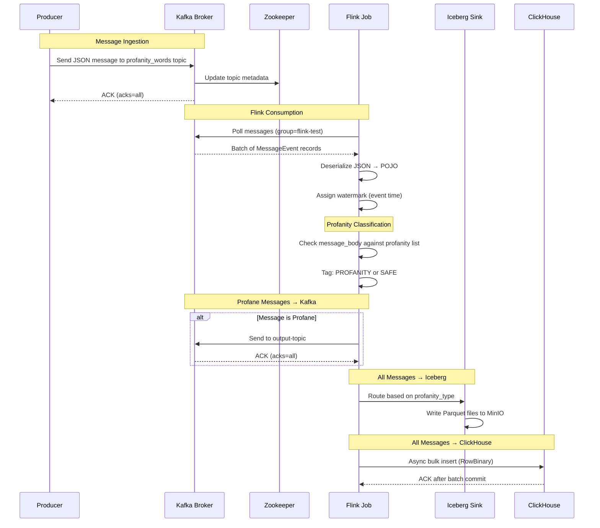
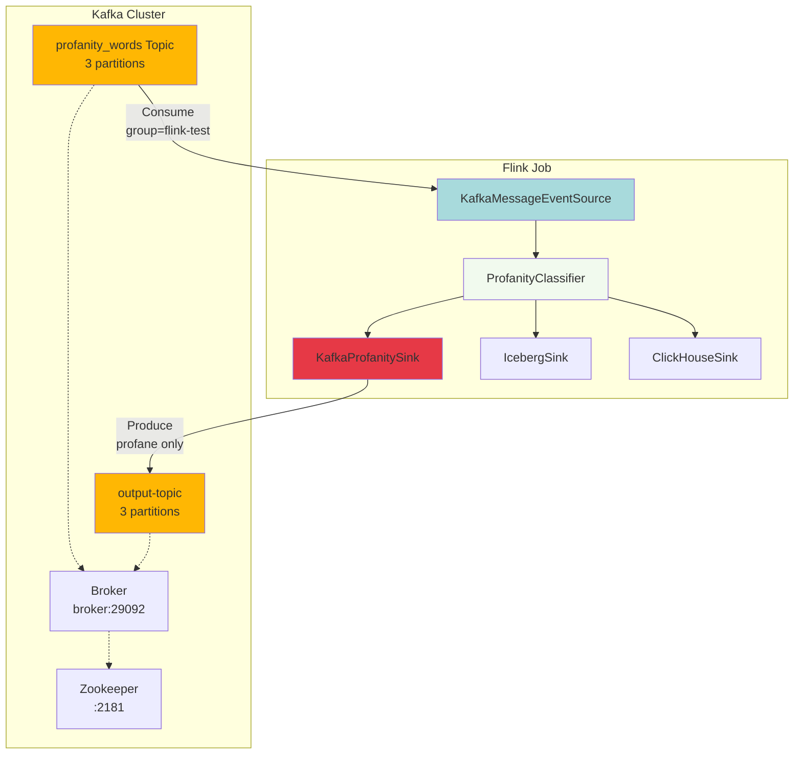
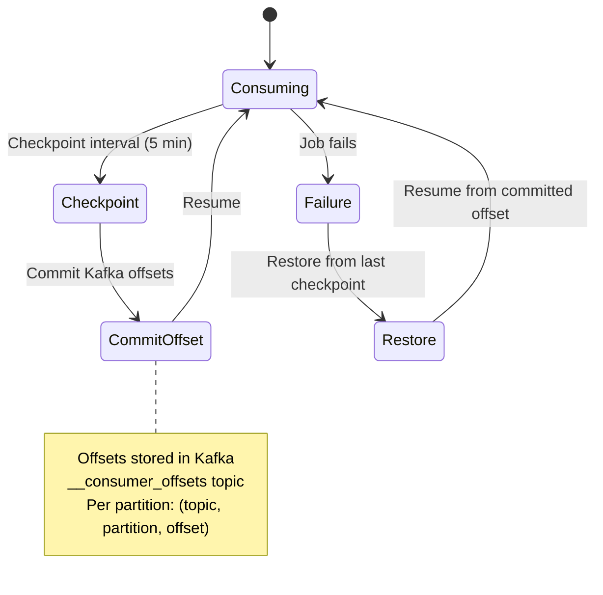

# Kafka Integration Deep Dive

## Table of Contents
1. [Overview](#overview)
2. [Kafka Source Configuration](#kafka-source-configuration)
3. [Message Deserialization](#message-deserialization)
4. [Watermark Strategy](#watermark-strategy)
5. [Kafka Sink Configuration](#kafka-sink-configuration)
6. [Code Walkthrough](#code-walkthrough)
7. [Configuration Parameters](#configuration-parameters)
8. [Kafka Architecture Diagram](#kafka-architecture-diagram)

---

## Overview

This system uses **Apache Kafka** as both the **source** and **sink** for message streaming:

- **Source**: Reads JSON messages from the `profanity_words` topic
- **Sink**: Writes profane messages to the `output-topic` for downstream processing

**Why Kafka?**
- **Distributed**: Scales horizontally with multiple brokers
- **Fault-tolerant**: Replicates data across brokers
- **Persistent**: Messages are stored on disk for durability
- **High-throughput**: Handles millions of messages per second
- **Exactly-once semantics**: Ensures no message loss or duplication when configured properly

---

## Kafka Source Configuration

### KafkaMessageEventSource.java - Line-by-Line Explanation

```java
package org.myorg.quickstart.job;

import org.apache.flink.api.common.eventtime.WatermarkStrategy;
import org.apache.flink.connector.kafka.source.KafkaSource;
import org.apache.flink.connector.kafka.source.enumerator.initializer.OffsetsInitializer;
import org.apache.flink.formats.json.JsonDeserializationSchema;
import org.apache.flink.streaming.api.datastream.DataStream;
import org.apache.flink.streaming.api.environment.StreamExecutionEnvironment;
import org.myorg.quickstart.model.MessageEvent;
import org.slf4j.Logger;
import org.slf4j.LoggerFactory;

import java.time.Duration;
```

**Import Breakdown:**
- `WatermarkStrategy`: Defines how Flink handles event-time processing and late data
- `KafkaSource`: New Flink 1.14+ Kafka connector (replaces deprecated FlinkKafkaConsumer)
- `OffsetsInitializer`: Controls where to start reading (earliest, latest, timestamp)
- `JsonDeserializationSchema`: Converts JSON bytes to POJOs using Jackson
- `Duration`: Used for watermark delay configuration

```java
public class KafkaMessageEventSource implements MessageEventSource {
    private static final Logger LOG = LoggerFactory.getLogger(KafkaMessageEventSource.class);
```

**Why implement MessageEventSource?**
- **Testability**: Allows mocking/stubbing in unit tests
- **Flexibility**: Can swap implementations (Kafka, Kinesis, file, mock)
- **Dependency Injection**: Main job doesn't know concrete implementation

```java
    @Override
    public DataStream<MessageEvent> getSource(StreamExecutionEnvironment env) {
        String bootstrapServers = System.getenv().getOrDefault("KAFKA_BOOTSTRAP_SERVERS", "broker:29092");
        LOG.info("Configuring Kafka source: bootstrap={}, topic=profanity_words, group=flink-test", bootstrapServers);
```

**Environment Variable Usage:**
- `KAFKA_BOOTSTRAP_SERVERS`: Kafka broker addresses (comma-separated if multiple)
- Default `broker:29092`: Docker Compose service name with internal port
- External port `9092` is for host machine access
- **Why 29092?** Internal Docker network port avoids conflicts with host Kafka

```java
        JsonDeserializationSchema<MessageEvent> fcdrJsonFormat = new JsonDeserializationSchema<>(MessageEvent.class);
```

**JSON Deserialization:**
- Uses **Jackson** under the hood
- Automatically maps JSON fields to `MessageEvent` POJO
- `@JsonProperty` annotations in MessageEvent handle field mapping
- `@JsonIgnoreProperties(ignoreUnknown = true)` allows schema evolution (new fields ignored)

```java
        KafkaSource<MessageEvent> ksource = KafkaSource.<MessageEvent>builder()
            .setBootstrapServers(bootstrapServers)
            .setTopics("profanity_words")
            .setGroupId("flink-test")
            .setStartingOffsets(OffsetsInitializer.earliest())
            .setValueOnlyDeserializer(fcdrJsonFormat)
            .setProperty("acks", "all")
            .build();
```

**Configuration Deep Dive:**

1. **`.setBootstrapServers(bootstrapServers)`**
   - Initial contact points for Kafka cluster
   - Flink discovers all brokers from these seeds
   - Multiple brokers: `"broker1:9092,broker2:9092"`

2. **`.setTopics("profanity_words")`**
   - Subscribes to a single topic
   - Can subscribe to multiple: `.setTopics("topic1", "topic2")`
   - Supports regex patterns: `.setTopicPattern(Pattern.compile("profanity.*"))`

3. **`.setGroupId("flink-test")`**
   - **Critical for offset management**
   - Kafka tracks each consumer group's position per partition
   - Multiple Flink jobs with same group ID share load (load balancing)
   - Different group IDs → independent consumption
   - **Why "flink-test"?** Identifies this Flink application in Kafka

4. **`.setStartingOffsets(OffsetsInitializer.earliest())`**
   - **Where to start reading:**
     - `earliest()`: Read all existing messages from beginning (replay all data)
     - `latest()`: Only new messages after job starts (ignore history)
     - `committed()`: Resume from last committed offset (default)
     - `timestamp(timestamp)`: Start from specific time
   - **Use case:** `earliest()` ensures no data loss on first run
   - **Production tip:** Use `committed()` after initial load

5. **`.setValueOnlyDeserializer(fcdrJsonFormat)`**
   - Only deserializes message value (ignores key)
   - Kafka messages have: `key | value | headers | metadata`
   - **Why value-only?** Our messages don't use keys for routing
   - Alternative: `setDeserializer()` for custom key+value deserialization

6. **`.setProperty("acks", "all")`**
   - **Wait!** This is a producer setting, not consumer
   - **Placed here by mistake** - doesn't affect source
   - **Should be removed** or moved to KafkaProfanitySink
   - **Correct consumer properties:**
     - `"enable.auto.commit", "false"` (Flink manages offsets)
     - `"auto.offset.reset", "earliest"`
     - `"max.poll.records", "500"`

```java
        LOG.info("Kafka source configured successfully");
```

**Logging Best Practice:**
- Logs configuration for debugging
- Shows in Flink JobManager logs
- Helps diagnose connection issues

```java
        LOG.info("Configuring watermark strategy with 10s bounded out-of-orderness");
        WatermarkStrategy<MessageEvent> watermarkStrategy = WatermarkStrategy
            .<MessageEvent>forBoundedOutOfOrderness(Duration.ofSeconds(10))
```

**Watermark Strategy Explained:**

**What are Watermarks?**
- Timestamps that mark progress in event time
- Tell Flink "all events before time T have arrived"
- Enable windowing and event-time operations

**Bounded Out-of-Orderness:**
- Allows events to arrive up to 10 seconds late
- Watermark = max_event_time - 10 seconds
- **Example:**
  - Events arrive: 12:00:05, 12:00:03, 12:00:08
  - Watermark = 12:00:08 - 10s = 11:59:58
  - Late event 11:59:55 → dropped or sent to side output

**Why 10 seconds?**
- **Trade-off:**
  - Shorter (e.g., 1s): Low latency, more late data
  - Longer (e.g., 60s): More complete results, higher latency
- **10s is typical** for near-real-time systems
- Adjust based on your SLA and data source characteristics

```java
            .withTimestampAssigner((event, recordTimestamp) -> {
                try {
                    String timestampStr = event.getTimestamp();
                    if (timestampStr != null && !timestampStr.isEmpty()) {
                        return java.time.Instant.parse(timestampStr).toEpochMilli();
                    }
                } catch (Exception e) {
                    LOG.warn("Failed to parse timestamp '{}' for event, using current time. Error: {}",
                        event.getTimestamp(), e.getMessage());
                }
                return System.currentTimeMillis();
            });
```

**Timestamp Assignment:**

1. **Lambda Parameters:**
   - `event`: The MessageEvent object
   - `recordTimestamp`: Kafka record timestamp (usually producer time)

2. **Timestamp Extraction:**
   ```java
   String timestampStr = event.getTimestamp();
   ```
   - Gets `timestamp` field from JSON payload
   - Expected format: ISO-8601 (e.g., "2025-01-01T10:00:00Z")

3. **Parsing:**
   ```java
   return java.time.Instant.parse(timestampStr).toEpochMilli();
   ```
   - `Instant.parse()`: Parses ISO-8601 strings
   - `.toEpochMilli()`: Converts to Unix timestamp (milliseconds since epoch)
   - **Why millis?** Flink internally uses long timestamps

4. **Error Handling:**
   ```java
   catch (Exception e) {
       return System.currentTimeMillis();
   }
   ```
   - **Fallback:** Use current system time if parsing fails
   - **Why?** Prevent job failure from malformed timestamps
   - **Better approach:** Send to dead-letter queue for investigation

5. **Null Checks:**
   ```java
   if (timestampStr != null && !timestampStr.isEmpty())
   ```
   - Prevents NullPointerException
   - Empty string check catches "" values

```java
        return env.fromSource(ksource, watermarkStrategy, "Kafka Source");
    }
}
```

**DataStream Creation:**
- `env.fromSource()`: Connects source to Flink execution environment
- `watermarkStrategy`: Applies event-time processing
- `"Kafka Source"`: Operator name (appears in Flink UI)

---

## Kafka Sink Configuration

### KafkaProfanitySink.java - Line-by-Line Explanation

```java
package org.myorg.quickstart.job;

import org.apache.flink.connector.base.DeliveryGuarantee;
import org.apache.flink.connector.kafka.sink.KafkaRecordSerializationSchema;
import org.apache.flink.connector.kafka.sink.KafkaSink;
import org.apache.flink.formats.json.JsonSerializationSchema;
import org.apache.flink.shaded.jackson2.com.fasterxml.jackson.databind.ObjectMapper;
import org.apache.flink.shaded.jackson2.com.fasterxml.jackson.databind.SerializationFeature;
import org.apache.flink.shaded.jackson2.com.fasterxml.jackson.datatype.jsr310.JavaTimeModule;
import org.apache.flink.streaming.api.datastream.DataStream;
import org.myorg.quickstart.model.MessageEvent;
import org.slf4j.Logger;
import org.slf4j.LoggerFactory;
```

**Import Highlights:**
- `DeliveryGuarantee`: Controls message durability (at-least-once, exactly-once)
- `KafkaSink`: New unified Kafka sink (replaces deprecated producers)
- `JavaTimeModule`: Jackson module for Java 8 time types
- `SerializationFeature`: Controls JSON output format

```java
public class KafkaProfanitySink implements MessageEventSink {
    private static final Logger LOG = LoggerFactory.getLogger(KafkaProfanitySink.class);

    @Override
    public void addSink(DataStream<MessageEvent> stream) {
        String bootstrapServers = System.getenv().getOrDefault("KAFKA_BOOTSTRAP_SERVERS", "broker:29092");
        LOG.info("Configuring Kafka sink for profane messages: bootstrap={}, topic=output-topic", bootstrapServers);
```

**Sink Initialization:**
- Same bootstrap servers as source (reuses Kafka cluster)
- Topic: `output-topic` (hardcoded - could be env var)
- **Design decision:** Separate topic for profane messages enables:
  - Independent scaling (more partitions if needed)
  - Dedicated consumer for alerting/moderation
  - Different retention policies

```java
        KafkaSink<MessageEvent> kafkaSink = KafkaSink.<MessageEvent>builder()
            .setBootstrapServers(bootstrapServers)
            .setRecordSerializer(KafkaRecordSerializationSchema.builder()
                .setTopic("output-topic")
                .setValueSerializationSchema(new JsonSerializationSchema<MessageEvent>(
                    () -> new ObjectMapper().registerModule(new JavaTimeModule())
                        .configure(SerializationFeature.WRITE_DATES_AS_TIMESTAMPS, false)))
                .build()
            )
```

**Serialization Configuration:**

1. **`KafkaRecordSerializationSchema.builder()`**
   - Defines how to convert MessageEvent → Kafka record
   - Configures topic, key, value, headers, partition

2. **`.setTopic("output-topic")`**
   - Static topic assignment
   - Alternative: `.setTopicSelector()` for dynamic routing

3. **`JsonSerializationSchema<MessageEvent>`**
   - Converts POJO to JSON bytes
   - Uses Jackson ObjectMapper

4. **Custom ObjectMapper:**
   ```java
   () -> new ObjectMapper()
       .registerModule(new JavaTimeModule())
       .configure(SerializationFeature.WRITE_DATES_AS_TIMESTAMPS, false)
   ```

   **Why this configuration?**

   a. **`registerModule(new JavaTimeModule())`**
      - Adds support for `java.time.*` types (Instant, LocalDateTime, etc.)
      - Without this: "Cannot serialize java.time.Instant" error

   b. **`WRITE_DATES_AS_TIMESTAMPS, false`**
      - `false`: Writes ISO-8601 strings: "2025-01-01T10:00:00Z"
      - `true`: Writes Unix timestamps: 1704106800000
      - **Why false?** Human-readable, preserves timezone info

```java
            .setProperty("acks", "all")
            .setDeliveryGuarantee(DeliveryGuarantee.AT_LEAST_ONCE)
            .build();
```

**Durability Settings:**

1. **`.setProperty("acks", "all")`**
   - Kafka producer acknowledgment level
   - **"all" (or "-1")**: Wait for all in-sync replicas to acknowledge
   - **Alternatives:**
     - `"0"`: No acknowledgment (fire-and-forget, fastest, can lose data)
     - `"1"`: Leader acknowledges (balanced)
   - **Why "all"?** Maximum durability for profane messages (critical data)

2. **`.setDeliveryGuarantee(DeliveryGuarantee.AT_LEAST_ONCE)`**
   - **AT_LEAST_ONCE**: Messages may be duplicated but never lost
     - Commits Kafka offsets after Flink checkpoint
     - On failure: replays from last checkpoint (duplicates possible)
   - **EXACTLY_ONCE**: No duplicates
     - Requires Kafka transactions
     - Higher overhead
     - Use with `.setTransactionalIdPrefix("flink-profanity-sink")`
   - **NONE**: No guarantees (testing only)

   **Why AT_LEAST_ONCE?**
   - Good balance of performance and reliability
   - Downstream consumers should be idempotent (handle duplicates)
   - EXACTLY_ONCE adds ~10-20% overhead

```java
        stream.sinkTo(kafkaSink).name("Kafka Sink (Profane)");
        LOG.info("Kafka sink attached for profanity messages");
    }
}
```

**Attaching Sink:**
- `.sinkTo()`: Terminal operator (ends stream processing)
- `.name("Kafka Sink (Profane)")`: Appears in Flink web UI
- **Note:** Only profane messages reach this sink (filtered in DataStreamJob)

---

## Message Deserialization

### MessageEvent POJO Structure

```java
@JsonIgnoreProperties(ignoreUnknown = true)
public class MessageEvent {
    @JsonProperty("account_id")
    private String accountId;

    @JsonProperty("message_id")
    private String messageId;

    @JsonProperty("message_body")
    private String messageBody;

    // ... other fields

    public enum ProfanityType {
        PROFANITY,
        SAFE
    }

    @JsonProperty("profanity_type")
    private ProfanityType profanityType;
}
```

**Jackson Annotations:**

1. **`@JsonIgnoreProperties(ignoreUnknown = true)`**
   - Ignores extra fields in JSON that don't match POJO
   - **Why?** Schema evolution - new fields won't break old code
   - Example: JSON has `"new_field": "value"` → ignored

2. **`@JsonProperty("account_id")`**
   - Maps JSON field name to Java field name
   - Converts snake_case → camelCase
   - Without annotation: Jackson expects `accountId` in JSON

3. **`ProfanityType` Enum**
   - Jackson serializes enums as strings: "PROFANITY" / "SAFE"
   - Alternative: `@JsonValue` for custom values

### Sample JSON Message

```json
{
  "account_id": "user123",
  "message_id": "msg-456",
  "message_body": "This message contains gun reference",
  "correlation_id": "corr-789",
  "message_status": "pending",
  "timestamp": "2025-01-15T14:30:00Z",
  "profanity_type": "PROFANITY"
}
```

**Field Mapping:**
- `account_id` → `accountId` (String)
- `timestamp` → parsed to Instant (event time)
- `profanity_type` → ProfanityType enum

---

## Watermark Strategy

### Event Time vs Processing Time

| Aspect | Event Time | Processing Time |
|--------|------------|-----------------|
| **Definition** | When event occurred in real world | When Flink processes event |
| **Source** | Message timestamp field | System.currentTimeMillis() |
| **Use Case** | Historical analysis, replay | Real-time dashboards |
| **Late Data** | Handled with watermarks | Not applicable |
| **Determinism** | Reproducible results | Non-deterministic |

**Why Event Time?**
- Messages may arrive out-of-order due to network delays
- Allows replaying historical data with correct results
- Enables time-based windows (e.g., "last 5 minutes")

### Watermark Propagation

```
Timeline:

T=0   T=5   T=10  T=15  T=20
|-----|-----|-----|-----|-----|
  ↓     ↓     ↓     ↓     ↓
Events arrive at Flink:

Event A (timestamp=10s) arrives at T=2
Event B (timestamp=5s)  arrives at T=3  (out of order!)
Event C (timestamp=15s) arrives at T=8

Watermarks (with 10s allowance):

T=2  → Watermark = 10s - 10s = 0s
T=3  → Watermark = 10s - 10s = 0s  (B is late but within 10s)
T=8  → Watermark = 15s - 10s = 5s
```

**Late Event Handling:**
- Event with timestamp < watermark → considered "late"
- Default: late events are dropped
- Alternative: `.sideOutputLateData()` captures them

---

## Configuration Parameters

### Environment Variables

| Variable | Default | Description | Example |
|----------|---------|-------------|---------|
| `KAFKA_BOOTSTRAP_SERVERS` | `broker:29092` | Kafka broker addresses | `kafka1:9092,kafka2:9092` |
| `KAFKA_INPUT_TOPIC` | `profanity_words` | Source topic (hardcoded) | `messages` |
| `KAFKA_OUTPUT_TOPIC` | `output-topic` | Sink topic (hardcoded) | `alerts` |
| `KAFKA_CONSUMER_GROUP` | `flink-test` | Consumer group ID (hardcoded) | `profanity-filter-v1` |

### Kafka Properties (Advanced)

**Consumer Properties:**
```java
.setProperty("fetch.min.bytes", "1048576")        // Min 1MB per fetch
.setProperty("fetch.max.wait.ms", "500")          // Max wait 500ms
.setProperty("max.partition.fetch.bytes", "2097152") // Max 2MB per partition
.setProperty("session.timeout.ms", "30000")       // 30s session timeout
.setProperty("heartbeat.interval.ms", "3000")     // Heartbeat every 3s
```

**Producer Properties:**
```java
.setProperty("compression.type", "snappy")        // Compress messages
.setProperty("batch.size", "16384")               // 16KB batch size
.setProperty("linger.ms", "10")                   // Wait 10ms to batch
.setProperty("buffer.memory", "33554432")         // 32MB buffer
.setProperty("max.in.flight.requests.per.connection", "5")
```

---

## Kafka Architecture Diagram



### Component Flow



### Offset Management



---

## Kafka Topics in Docker Compose

### Topic Creation

```yaml
init-kafka:
  image: quay.io/strimzi/kafka:0.31.1-kafka-3.2.0
  command: |
    "
    bin/kafka-topics.sh --bootstrap-server broker:29092 --create --if-not-exists --topic profanity_words --replication-factor 1 --partitions 3
    bin/kafka-topics.sh --bootstrap-server broker:29092 --create --if-not-exists --topic output-topic --replication-factor 1 --partitions 3
    "
```

**Configuration:**
- `--replication-factor 1`: Single replica (acceptable for dev, use 3+ in prod)
- `--partitions 3`: Distributes load across 3 partitions
  - More partitions = higher parallelism
  - Each Flink subtask reads from 1+ partitions
- `--if-not-exists`: Idempotent creation

### Partition Assignment

```
profanity_words topic (3 partitions):

Partition 0: [msg1, msg4, msg7, ...]
Partition 1: [msg2, msg5, msg8, ...]
Partition 2: [msg3, msg6, msg9, ...]

Flink Job (parallelism=2):
- Subtask 0 reads: P0 + P1
- Subtask 1 reads: P2

Rebalancing on failure:
- Subtask 0 fails → Subtask 1 takes over P0, P1, P2
```

---

## Testing Kafka Integration

### 1. Produce Test Messages

```bash
# Enter Kafka container
docker exec -it broker bash

# Produce profane message
kafka-console-producer --broker-list broker:29092 --topic profanity_words << EOF
{"account_id":"acc1","message_id":"m1","message_body":"This has a gun reference","correlation_id":"c1","message_status":"new","timestamp":"2025-01-15T10:00:00Z"}
EOF

# Produce safe message
kafka-console-producer --broker-list broker:29092 --topic profanity_words << EOF
{"account_id":"acc2","message_id":"m2","message_body":"Hello world","correlation_id":"c2","message_status":"new","timestamp":"2025-01-15T10:05:00Z"}
EOF
```

### 2. Consume from Output Topic

```bash
# View profane messages only
kafka-console-consumer --bootstrap-server broker:29092 --topic output-topic --from-beginning

# Expected output:
{"account_id":"acc1","message_id":"m1","message_body":"This has a gun reference",...,"profanity_type":"PROFANITY"}

# Safe message should NOT appear here
```

### 3. Check Consumer Offsets

```bash
# View consumer group status
kafka-consumer-groups --bootstrap-server broker:29092 --describe --group flink-test

# Output shows:
GROUP          TOPIC            PARTITION  CURRENT-OFFSET  LOG-END-OFFSET  LAG
flink-test     profanity_words  0          150             150             0
flink-test     profanity_words  1          148             148             0
flink-test     profanity_words  2          152             152             0
```

**Metrics:**
- `CURRENT-OFFSET`: Last committed position
- `LOG-END-OFFSET`: Latest message in partition
- `LAG`: Messages behind (0 = caught up)

---

## Performance Considerations

### Throughput Optimization

1. **Increase Parallelism:**
   ```java
   env.setParallelism(8);  // Match number of partitions or more
   ```

2. **Tune Kafka Properties:**
   ```java
   .setProperty("fetch.min.bytes", "1048576")  // Fetch 1MB at a time
   .setProperty("max.poll.records", "500")     // Process 500 records per poll
   ```

3. **Batching in Sink:**
   ```java
   .setProperty("batch.size", "65536")        // 64KB batches
   .setProperty("linger.ms", "50")            // Wait 50ms to accumulate
   ```

### Latency Optimization

1. **Reduce Watermark Delay:**
   ```java
   .forBoundedOutOfOrderness(Duration.ofSeconds(1))  // 1s instead of 10s
   ```

2. **Decrease Checkpoint Interval:**
   ```java
   env.enableCheckpointing(30000);  // 30s instead of 5 minutes
   ```

3. **Minimize Batching:**
   ```java
   .setProperty("linger.ms", "0")   // Send immediately
   ```

---

## Troubleshooting

### Issue: No Messages Consumed

**Symptoms:**
- Flink job running but no records processed
- Kafka lag remains at 0

**Solutions:**
1. Check topic exists:
   ```bash
   kafka-topics --bootstrap-server broker:29092 --list | grep profanity_words
   ```

2. Verify messages in topic:
   ```bash
   kafka-console-consumer --bootstrap-server broker:29092 --topic profanity_words --from-beginning --max-messages 5
   ```

3. Check consumer group:
   ```bash
   kafka-consumer-groups --bootstrap-server broker:29092 --group flink-test --describe
   ```

4. Review Flink logs:
   ```bash
   docker logs -f jobmanager | grep -i kafka
   ```

### Issue: JSON Deserialization Failures

**Symptoms:**
- Flink logs: "Failed to deserialize JSON"
- Messages skipped

**Solutions:**
1. Validate JSON format:
   ```bash
   echo '{"account_id":"test"}' | jq .
   ```

2. Add detailed logging:
   ```java
   JsonDeserializationSchema<MessageEvent> schema = new JsonDeserializationSchema<>(MessageEvent.class);
   schema.setFailOnMissingField(false);  // Don't fail on missing fields
   ```

3. Use side output for failures:
   ```java
   OutputTag<String> failedRecords = new OutputTag<String>("failed-deserialization"){};
   // Collect failed records for debugging
   ```

### Issue: High Consumer Lag

**Symptoms:**
- Lag increasing over time
- Flink can't keep up with Kafka

**Solutions:**
1. **Increase Flink parallelism:**
   ```yaml
   environment:
     - FLINK_PROPERTIES=parallelism.default: 8
   ```

2. **Scale Flink TaskManagers:**
   ```yaml
   flink_task_manager:
     deploy:
       replicas: 3  # Add more workers
   ```

3. **Optimize processing:**
   - Profile with Flink metrics
   - Reduce expensive operations (e.g., external API calls)

---

## Summary

**Kafka in This Pipeline:**

1. **Source (KafkaMessageEventSource):**
   - Reads from `profanity_words` topic
   - Deserializes JSON to MessageEvent POJOs
   - Assigns event-time watermarks (10s bounded out-of-orderness)
   - Consumer group: `flink-test`

2. **Sink (KafkaProfanitySink):**
   - Writes profane messages to `output-topic`
   - Serializes POJOs to JSON with ISO-8601 timestamps
   - Guarantees: AT_LEAST_ONCE delivery
   - Acknowledgment: `acks=all` for durability

3. **Event-Time Processing:**
   - Enables correct ordering and windowing
   - Handles late data (up to 10s delay)
   - Supports replay with deterministic results

4. **Integration with Flink:**
   - Checkpointing commits Kafka offsets (exactly-once source)
   - Parallelism maps to Kafka partitions
   - Offset management via Flink state

**Key Takeaways:**
- Kafka provides durable, scalable message streaming
- Flink's new Kafka connectors (KafkaSource/KafkaSink) replace deprecated APIs
- Watermarks enable event-time processing for out-of-order data
- Proper configuration balances throughput, latency, and durability
