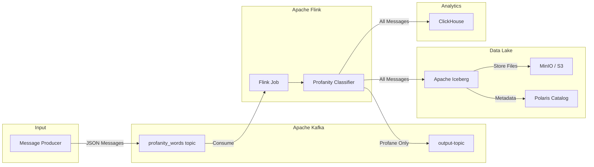
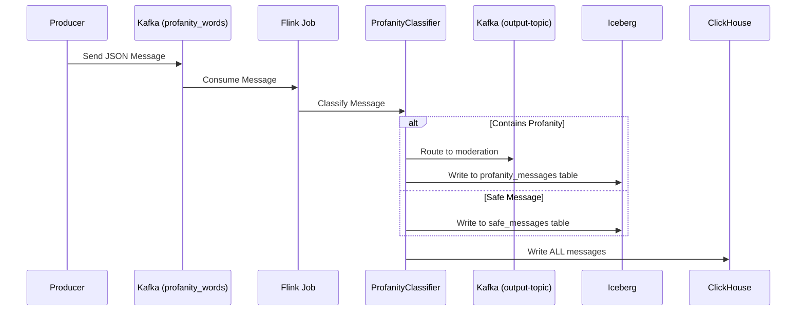
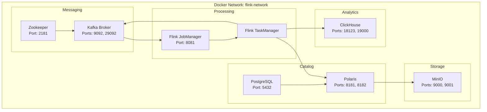
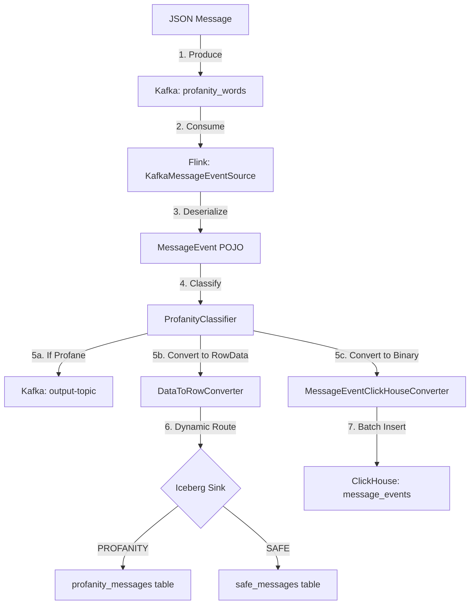

# Real-Time Profanity Filtering Pipeline - Complete Documentation

Welcome to the comprehensive documentation for this **Real-Time Data Engineering Pipeline**. This guide is designed for **beginner Data Engineers** who want to understand how modern streaming data systems work.

## 📚 Documentation Index

This documentation is split into multiple files for easier navigation:

| Document | Description |
|----------|-------------|
| [README-MAIN.md](./README-MAIN.md) | **You are here** - Overview and Architecture |
| [README-KAFKA.md](./README-KAFKA.md) | Apache Kafka - Message Streaming |
| [README-FLINK.md](./flink/README-FLINK.md) | Apache Flink - Stream Processing |
| [README-ICEBERG.md](./iceberg/README-ICEBERG.md) | Apache Iceberg & MinIO - Data Lake |
| [README-POLARIS.md](./polaris/README-POLARIS.md) | Apache Polaris - Iceberg Catalog Service |
| [README-CLICKHOUSE.md](./clickhouse/README-CLICKHOUSE.md) | ClickHouse - Analytics Database |
| [README-DOCKER.md](./docker/README-DOCKER.md) | Docker Infrastructure |

---

## 🎯 What Does This Project Do?

Imagine you're building a messaging platform (like WhatsApp or Slack). Users send messages, and you need to:

1. **Detect bad words** (profanity) in real-time
2. **Route profane messages** to a moderation queue
3. **Store all messages** in a Data Lake for historical analysis
4. **Enable fast queries** for dashboards and reports

This project demonstrates exactly that using industry-standard tools.

---

## 🏗️ High-Level Architecture



---

## 🔄 Detailed Data Flow

Here's exactly what happens when a message enters the system:



---

## 📦 Message Structure

Every message in the system follows this JSON structure:

```json
{
    "account_id": "user123",
    "message_id": "msg-uuid-here",
    "message_body": "Hello, this is my message!",
    "correlation_id": "corr-123",
    "message_status": "SENT",
    "timestamp": "2025-01-15T10:30:00Z"
}
```

After processing, Flink adds a `profanity_type` field:

```json
{
    "account_id": "user123",
    "message_id": "msg-uuid-here",
    "message_body": "Hello, this is my message!",
    "correlation_id": "corr-123",
    "message_status": "SENT",
    "timestamp": "2025-01-15T10:30:00Z",
    "profanity_type": "SAFE"
}
```

The `profanity_type` can be:
- `SAFE` - No bad words detected
- `PROFANITY` - Contains words from the blocklist

---

## 🛠️ Technology Stack Overview

### Why These Tools?

| Tool | Role | Why We Use It |
|------|------|---------------|
| **Apache Kafka** | Message Queue | Handles millions of messages/sec, never loses data |
| **Apache Flink** | Stream Processor | Processes data in real-time with exactly-once guarantees |
| **Apache Iceberg** | Table Format | Makes data lake files act like database tables |
| **MinIO** | Object Storage | S3-compatible storage that runs locally |
| **Apache Polaris** | Catalog | Tracks where all Iceberg tables are located |
| **ClickHouse** | Analytics DB | Answers queries in milliseconds on billions of rows |
| **PostgreSQL** | Metadata DB | Stores Polaris catalog metadata |
| **Docker** | Containerization | Runs everything in isolated, reproducible containers |

---

## 🏛️ Infrastructure Architecture



---

## 🚀 Quick Start

### Prerequisites
- Docker and Docker Compose installed
- At least 8GB RAM available
- Ports 8081, 8181, 9000, 9001, 9092, 18123 available

### Step 1: Start Everything

```bash
docker-compose up -d
```

This starts all 12+ containers. Wait 2-3 minutes for everything to initialize.

### Step 2: Check Status

```bash
# See all running containers
docker-compose ps

# Check Flink dashboard
open http://localhost:8081

# Check MinIO console
open http://localhost:9001  # Login: admin / password
```

### Step 3: Send Test Messages

```bash
# Enter the Kafka container
docker exec -it broker bash

# Send a safe message
echo '{"account_id":"user1","message_id":"msg1","message_body":"Hello world","correlation_id":"c1","message_status":"SENT","timestamp":"2025-01-15T10:00:00Z"}' | \
  kafka-console-producer --broker-list localhost:9092 --topic profanity_words

# Send a profane message (assuming "badword" is in profanity_list.txt)
echo '{"account_id":"user2","message_id":"msg2","message_body":"This has badword in it","correlation_id":"c2","message_status":"SENT","timestamp":"2025-01-15T10:01:00Z"}' | \
  kafka-console-producer --broker-list localhost:9092 --topic profanity_words
```

### Step 4: Verify Results

```bash
# Check ClickHouse for all messages
docker exec -it clickhouse clickhouse-client --password password \
  -q "SELECT * FROM message_events"

# Check profane messages in output topic
docker exec -it broker kafka-console-consumer \
  --bootstrap-server localhost:9092 \
  --topic output-topic \
  --from-beginning
```

---

## 📊 Data Flow Summary



---

## 📁 Project Structure

```
quickstart/
├── docs/                          # Documentation (you are here)
│   ├── README-MAIN.md            # Overview and architecture
│   ├── README-KAFKA.md           # Kafka deep-dive
│   ├── flink/
│   │   └── README-FLINK.md       # Flink job explanation
│   ├── iceberg/
│   │   └── README-ICEBERG.md     # Iceberg/Polaris/MinIO
│   ├── clickhouse/
│   │   └── README-CLICKHOUSE.md  # ClickHouse analytics
│   └── docker/
│       └── README-DOCKER.md      # Docker infrastructure
├── src/main/java/org/myorg/quickstart/
│   ├── job/                       # Flink job components
│   │   ├── DataStreamJob.java    # Main entry point
│   │   ├── ProfanityClassifier.java
│   │   ├── KafkaMessageEventSource.java
│   │   ├── KafkaProfanitySink.java
│   │   ├── IcebergMessageEventSink.java
│   │   └── ClickHouseMessageEventSink.java
│   ├── model/
│   │   └── MessageEvent.java     # Data model
│   └── sink/                      # Sink utilities
│       ├── IcebergSinkFunction.java
│       ├── DataToRowConverter.java
│       ├── ClickHouseSinkFactory.java
│       └── MessageEventClickHouseConverter.java
├── src/main/resources/
│   └── profanity_list.txt        # Words to block
├── docker-compose.yml            # Infrastructure definition
├── Dockerfile                    # Flink job container
├── pom.xml                       # Maven dependencies
└── architecture.drawio           # Visual diagrams
```

---

## 🔗 Next Steps

Now that you understand the big picture, dive into the specific components:

1. **[Kafka Documentation](./README-KAFKA.md)** - Learn how messages flow through Kafka
2. **[Flink Documentation](./flink/README-FLINK.md)** - Understand the stream processing logic
3. **[Iceberg Documentation](./iceberg/README-ICEBERG.md)** - See how the Data Lake works
4. **[Polaris Documentation](./polaris/README-POLARIS.md)** - Deep dive into the catalog service
5. **[ClickHouse Documentation](./clickhouse/README-CLICKHOUSE.md)** - Explore real-time analytics
6. **[Docker Documentation](./docker/README-DOCKER.md)** - Understand the infrastructure

---

## 🆘 Troubleshooting

### Common Issues

| Problem | Solution |
|---------|----------|
| Containers won't start | Check if ports are in use: `lsof -i :8081` |
| Flink job not running | Check logs: `docker logs jobmanager` |
| No data in ClickHouse | Verify Kafka has messages: `docker exec broker kafka-console-consumer --bootstrap-server localhost:9092 --topic profanity_words --from-beginning` |
| MinIO empty | Check Polaris setup: `docker logs polaris-setup` |

### Useful Commands

```bash
# View all logs
docker-compose logs -f

# Restart a specific service
docker-compose restart jobmanager

# Clean everything and start fresh
docker-compose down -v
docker-compose up -d
```

---

*This documentation is part of the Real-Time Profanity Filtering Pipeline project.*
