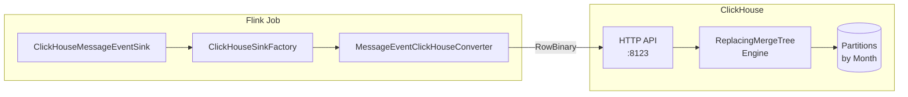
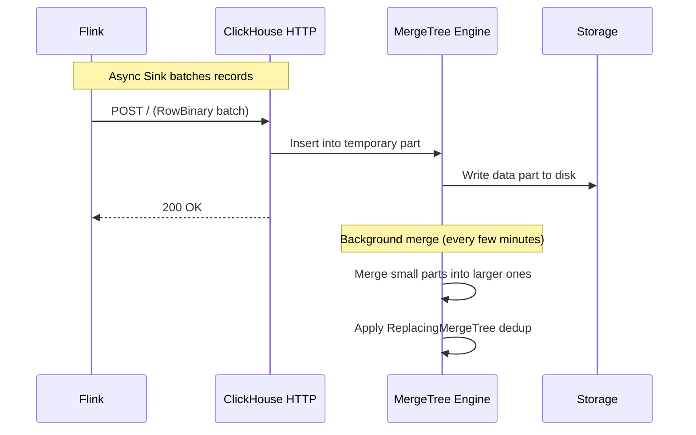
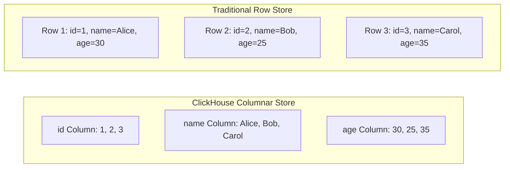
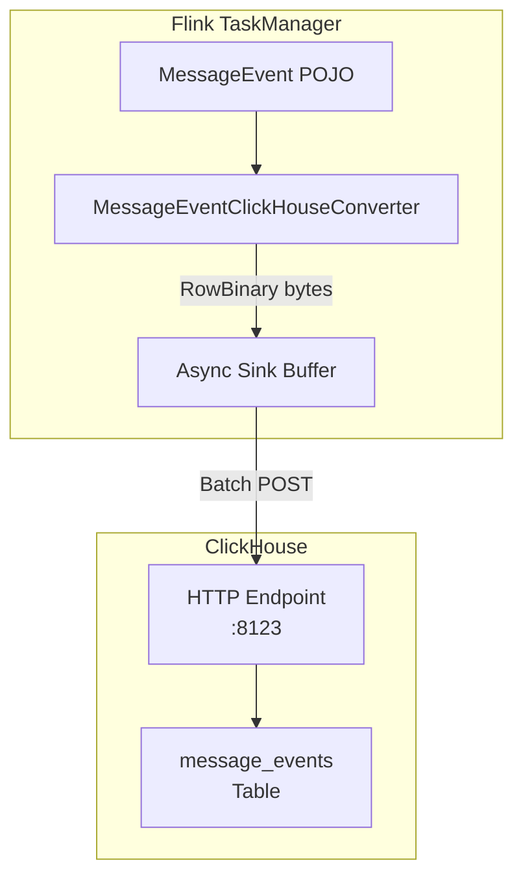
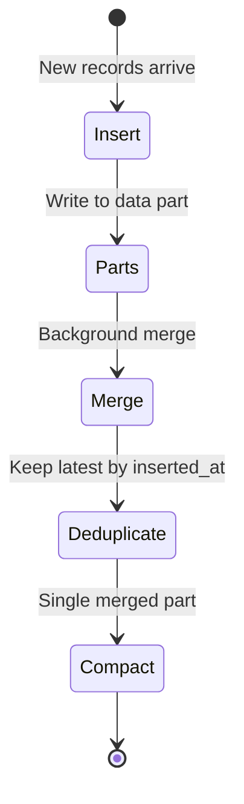
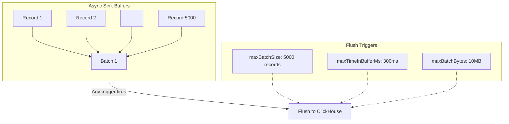

# ClickHouse - Real-Time Analytics Deep Dive

## Table of Contents
1. [Overview](#overview)
2. [ClickHouse Architecture](#clickhouse-architecture)
3. [Flink Integration](#flink-integration)
4. [Table Schema & Engine](#table-schema--engine)
5. [Async Sink Implementation](#async-sink-implementation)
6. [RowBinary Serialization](#rowbinary-serialization)
7. [Querying Iceberg Tables](#querying-iceberg-tables)
8. [Configuration Reference](#configuration-reference)
9. [Query Examples](#query-examples)

---

## Overview

**ClickHouse** is a column-oriented OLAP database designed for real-time analytics. In this pipeline, it serves as the **fast query layer** for all processed messages.

**Why ClickHouse?**
- **Blazing Fast**: Queries on billions of rows in milliseconds
- **Columnar Storage**: Optimized for analytical workloads
- **Real-Time Inserts**: Handles high-throughput streaming writes
- **SQL Interface**: Standard SQL for familiarity



---

## ClickHouse Architecture

### How ClickHouse Handles Inserts



### Column-Oriented Storage



**Benefits of Columnar:**
- Only read columns needed for query
- Better compression (similar data types together)
- Vectorized processing (SIMD instructions)

---

## Flink Integration

### ClickHouseMessageEventSink.java

```java
public class ClickHouseMessageEventSink implements MessageEventSink {
    @Override
    public void addSink(DataStream<MessageEvent> stream) {
        // Configuration from environment
        String jdbcUrl = System.getenv().getOrDefault(
            "CLICKHOUSE_JDBC_URL", "http://clickhouse:8123");
        String user = System.getenv().getOrDefault("CLICKHOUSE_USER", "default");
        String password = System.getenv().getOrDefault("CLICKHOUSE_PASSWORD", "changeme");
        String database = System.getenv().getOrDefault("CLICKHOUSE_DATABASE", "default");
        String table = System.getenv().getOrDefault("CLICKHOUSE_TABLE", "message_events");

        // Create async sink via factory
        var sink = ClickHouseSinkFactory.create(jdbcUrl, user, password, database, table);
        stream.sinkTo(sink).name("ClickHouse Sink");
    }
}
```

### Data Flow



---

## Table Schema & Engine

### DDL Statement

```sql
CREATE TABLE IF NOT EXISTS default.message_events
(
    account_id       String,
    message_id       String,
    message_body     String,
    correlation_id   String,
    message_status   String,
    event_time       DateTime64(3),
    profanity_type   String,
    inserted_at      DateTime64(3) MATERIALIZED now()
)
ENGINE = ReplacingMergeTree(inserted_at)
PARTITION BY toYYYYMM(event_time)
ORDER BY (account_id, message_id);
```

### Column Breakdown

| Column | Type | Description |
|--------|------|-------------|
| `account_id` | String | User account identifier |
| `message_id` | String | Unique message ID |
| `message_body` | String | Message content |
| `correlation_id` | String | Request correlation ID |
| `message_status` | String | Delivery status |
| `event_time` | DateTime64(3) | Event timestamp (millisecond precision) |
| `profanity_type` | String | PROFANITY or SAFE |
| `inserted_at` | DateTime64(3) | Insertion time (auto-populated) |

### ReplacingMergeTree Engine



**Why ReplacingMergeTree?**
- Handles duplicate inserts from Flink retries
- Keeps only the latest version of each row
- Deduplication happens during background merges

**ORDER BY Columns:**
- `(account_id, message_id)` = Primary key for deduplication
- Messages with same account_id + message_id are deduplicated

---

## Async Sink Implementation

### ClickHouseSinkFactory.java

```java
public class ClickHouseSinkFactory {
    public static ClickHouseAsyncSink<MessageEvent> create(
            String jdbcUrl, String username, String password,
            String database, String tableName) {
        
        // Client configuration
        ClickHouseClientConfig config = new ClickHouseClientConfig(
            jdbcUrl, username, password, database, tableName);

        // Batching configuration
        final int maxBatchSize = 5000;            // Max records per batch
        final int maxInFlightRequests = 15;       // Concurrent HTTP requests
        final int maxBufferedRequests = 10000;    // Buffer capacity
        final long maxBatchBytes = 10L * 1024 * 1024;  // 10MB max batch
        final long maxTimeInBufferMs = 300;       // Flush every 300ms
        final long maxRecordBytes = 4L * 1024 * 1024;  // 4MB max record

        ElementConverter<MessageEvent, ClickHousePayload> converter =
            new ClickHouseConvertor<>(MessageEvent.class, 
                new MessageEventClickHouseConverter());

        ClickHouseAsyncSink<MessageEvent> sink = new ClickHouseAsyncSink<>(
            converter, maxBatchSize, maxInFlightRequests, maxBufferedRequests,
            maxBatchBytes, maxTimeInBufferMs, maxRecordBytes, config);
        
        sink.setClickHouseFormat(ClickHouseFormat.RowBinary);
        return sink;
    }
}
```

### Batching Strategy



**Batching Parameters:**

| Parameter | Value | Purpose |
|-----------|-------|---------|
| `maxBatchSize` | 5000 | Max records before flush |
| `maxTimeInBufferMs` | 300 | Max wait time (latency bound) |
| `maxBatchBytes` | 10MB | Max batch size in bytes |
| `maxInFlightRequests` | 15 | Concurrent batches to ClickHouse |
| `maxBufferedRequests` | 10000 | Total buffer capacity |

---

## RowBinary Serialization

### MessageEventClickHouseConverter.java

RowBinary is ClickHouse's native binary format - fast and compact:

```java
public class MessageEventClickHouseConverter extends POJOConvertor<MessageEvent> {
    @Override
    public void instrument(OutputStream out, MessageEvent r) throws IOException {
        // 1. account_id (String)
        Serialize.writeString(out, r.getAccountId() != null ? r.getAccountId() : "",
            false, false, ClickHouseDataType.String, false, "account_id");

        // 2. message_id (String)
        Serialize.writeString(out, r.getMessageId() != null ? r.getMessageId() : "",
            false, false, ClickHouseDataType.String, false, "message_id");

        // 3. message_body (String)
        Serialize.writeString(out, r.getMessageBody() != null ? r.getMessageBody() : "",
            false, false, ClickHouseDataType.String, false, "message_body");

        // 4. correlation_id (String)
        Serialize.writeString(out, r.getCorrelationId() != null ? r.getCorrelationId() : "",
            false, false, ClickHouseDataType.String, false, "correlation_id");

        // 5. message_status (String)
        Serialize.writeString(out, r.getMessageStatus() != null ? r.getMessageStatus() : "",
            false, false, ClickHouseDataType.String, false, "message_status");

        // 6. event_time (DateTime64(3) = epoch milliseconds as Int64)
        long epochMillis;
        try {
            if (r.getTimestamp() != null) {
                epochMillis = Instant.parse(r.getTimestamp()).toEpochMilli();
            } else {
                epochMillis = System.currentTimeMillis();
            }
        } catch (Exception e) {
            epochMillis = System.currentTimeMillis();
        }
        Serialize.writeInt64(out, epochMillis, false, false, 
            ClickHouseDataType.DateTime64, false, "event_time");

        // 7. profanity_type (String)
        String type = r.getProfanityType() != null ? r.getProfanityType().name() : "SAFE";
        Serialize.writeString(out, type, false, false, 
            ClickHouseDataType.String, false, "profanity_type");
    }
}
```

### Field Order Importance

> ⚠️ **Critical**: Field order in serialization MUST match column order in table DDL!

```
DDL Order:           Serialization Order:
1. account_id    →   1. account_id
2. message_id    →   2. message_id  
3. message_body  →   3. message_body
4. correlation_id→   4. correlation_id
5. message_status→   5. message_status
6. event_time    →   6. event_time
7. profanity_type→   7. profanity_type
(inserted_at is MATERIALIZED - not sent)
```

---

## Querying Iceberg Tables

ClickHouse can query Iceberg tables directly via the **DataLakeCatalog** or **iceberg()** table function.

### Option A: DataLakeCatalog Database

```sql
-- Database created by polaris-setup
CREATE DATABASE demo ENGINE = DataLakeCatalog(
  'http://polaris:8181/api/catalog/v1/lakehouse'
) SETTINGS 
  catalog_type='rest', 
  storage_endpoint='http://minio:9000',
  catalog_credential='<client_id>:<client_secret>',
  oauth_server_uri='http://polaris:8181/api/catalog/v1/oauth/tokens',
  aws_access_key_id='admin',
  aws_secret_access_key='password';

-- Query tables
SHOW TABLES FROM demo;
SELECT * FROM demo.`raw_messages.profanity_messages` LIMIT 5;
```

### Option B: iceberg() Table Function

```sql
-- Direct access to Iceberg table via MinIO path
SELECT * FROM iceberg(
  'http://minio:9000/lakehouse/raw_messages/safe_messages', 
  'admin', 
  'password'
) LIMIT 5;

-- Query profanity messages
SELECT 
  account_id,
  message_body,
  profanity_type,
  timestamp
FROM iceberg(
  'http://minio:9000/lakehouse/raw_messages/profanity_messages', 
  'admin', 
  'password'
)
WHERE timestamp > '2025-01-01';
```

---

## Configuration Reference

### Environment Variables

| Variable | Default | Description |
|----------|---------|-------------|
| `CLICKHOUSE_JDBC_URL` | `http://clickhouse:8123` | ClickHouse HTTP endpoint |
| `CLICKHOUSE_USER` | `default` | ClickHouse username |
| `CLICKHOUSE_PASSWORD` | `password` | ClickHouse password |
| `CLICKHOUSE_DATABASE` | `default` | Target database |
| `CLICKHOUSE_TABLE` | `message_events` | Target table |

### Docker Configuration

```yaml
clickhouse:
  image: clickhouse:25.3.10.19
  container_name: clickhouse
  ports:
    - "18123:8123"   # HTTP interface
    - "19000:9000"   # Native interface
  environment:
    CLICKHOUSE_DB: default
    CLICKHOUSE_PASSWORD: password
    CLICKHOUSE_DEFAULT_ACCESS_MANAGEMENT: "1"
```

**Port Mapping:**
- `18123:8123` - HTTP queries (host:container)
- `19000:9000` - Native protocol (host:container)

---

## Query Examples

### Basic Queries

```sql
-- Count all messages
SELECT count() FROM default.message_events;

-- Latest 10 messages
SELECT * FROM default.message_events 
ORDER BY event_time DESC 
LIMIT 10;

-- Profanity statistics
SELECT 
  profanity_type, 
  count() as total,
  round(count() * 100.0 / sum(count()) OVER(), 2) as percentage
FROM default.message_events 
GROUP BY profanity_type;
```

### Time-Based Analytics

```sql
-- Messages per hour
SELECT 
  toStartOfHour(event_time) as hour,
  count() as message_count
FROM default.message_events
WHERE event_time > now() - INTERVAL 24 HOUR
GROUP BY hour
ORDER BY hour;

-- Daily profanity trends
SELECT 
  toDate(event_time) as day,
  countIf(profanity_type = 'PROFANITY') as profane,
  countIf(profanity_type = 'SAFE') as safe
FROM default.message_events
GROUP BY day
ORDER BY day;
```

### Account Analysis

```sql
-- Top accounts by profanity count
SELECT 
  account_id,
  count() as profane_messages
FROM default.message_events
WHERE profanity_type = 'PROFANITY'
GROUP BY account_id
ORDER BY profane_messages DESC
LIMIT 10;

-- Account activity heatmap
SELECT 
  account_id,
  toHour(event_time) as hour,
  count() as messages
FROM default.message_events
GROUP BY account_id, hour
ORDER BY account_id, hour;
```

### Force Deduplication

```sql
-- Force merge to apply ReplacingMergeTree deduplication
OPTIMIZE TABLE default.message_events FINAL;

-- Verify no duplicates
SELECT 
  account_id, 
  message_id, 
  count() as occurrences
FROM default.message_events
GROUP BY account_id, message_id
HAVING occurrences > 1;
```

---

## Troubleshooting

| Issue | Symptoms | Solution |
|-------|----------|----------|
| **Connection refused** | Flink logs: "connection refused" | Check `docker-compose ps clickhouse` |
| **401 Unauthorized** | HTTP 401 errors | Verify CLICKHOUSE_USER and CLICKHOUSE_PASSWORD |
| **Insert failures** | Records not appearing | Check `docker logs clickhouse` for errors |
| **Schema mismatch** | "Column not found" errors | Ensure serializer order matches DDL |
| **Duplicate records** | More rows than expected | Run `OPTIMIZE TABLE ... FINAL` |

### Useful Commands

```bash
# Access ClickHouse CLI
docker exec -it clickhouse clickhouse-client --password password

# Check table structure
docker exec -it clickhouse clickhouse-client --password password \
  -q "DESCRIBE default.message_events"

# View recent data
docker exec -it clickhouse clickhouse-client --password password \
  -q "SELECT * FROM default.message_events ORDER BY event_time DESC LIMIT 5"

# Check table size
docker exec -it clickhouse clickhouse-client --password password \
  -q "SELECT formatReadableSize(sum(bytes_on_disk)) FROM system.parts WHERE table = 'message_events'"
```

---

*This documentation is part of the Real-Time Profanity Filtering Pipeline project.*
