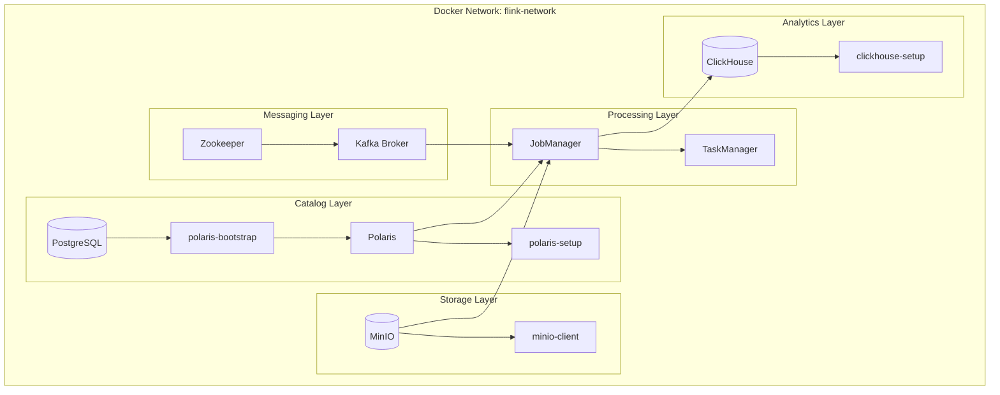
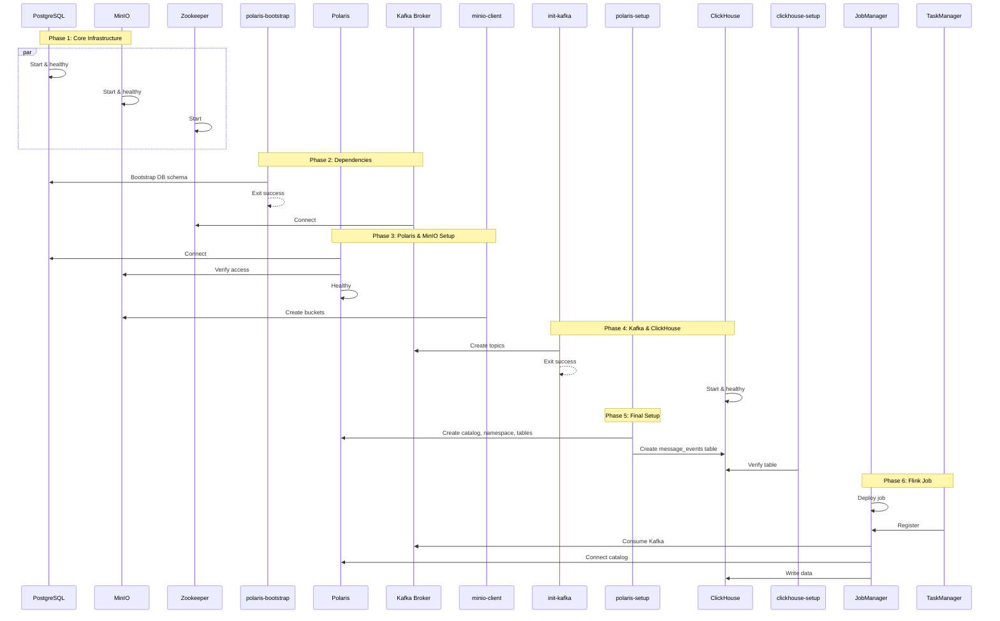
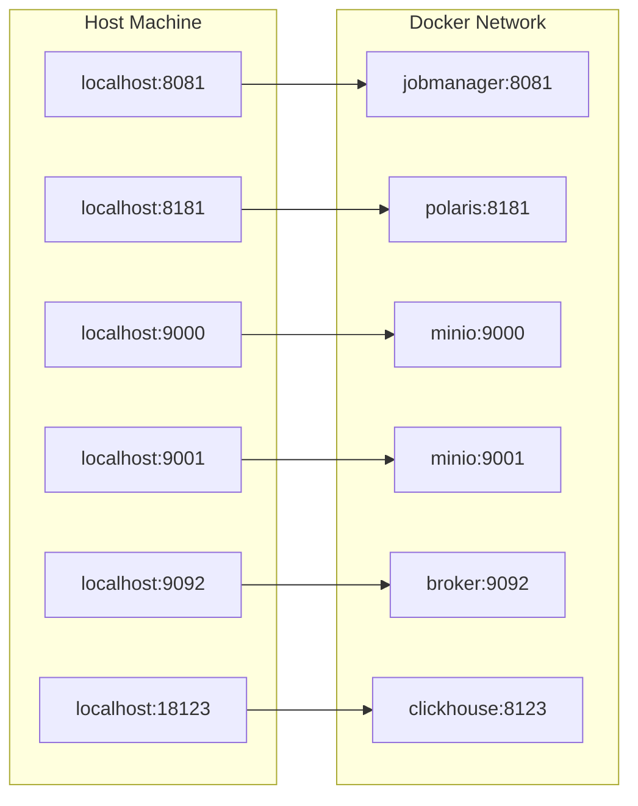
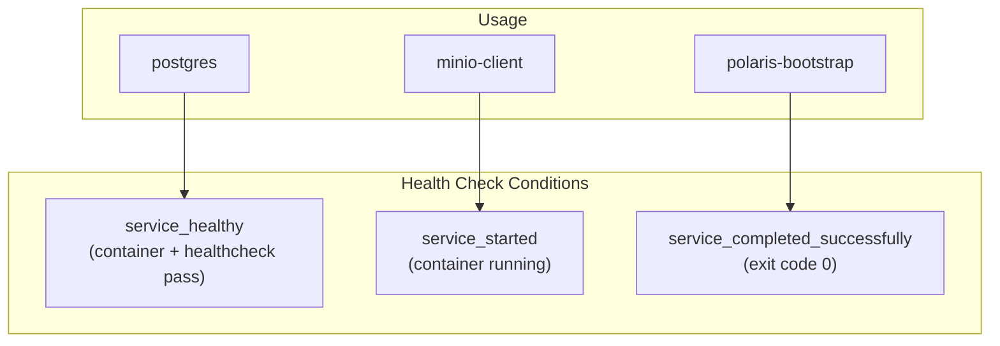

# Docker Infrastructure Deep Dive

## Table of Contents
1. [Overview](#overview)
2. [Service Architecture](#service-architecture)
3. [Container Dependencies](#container-dependencies)
4. [Network Configuration](#network-configuration)
5. [Service Reference](#service-reference)
6. [Health Checks & Startup Order](#health-checks--startup-order)
7. [Volume Management](#volume-management)
8. [Common Operations](#common-operations)
9. [Troubleshooting](#troubleshooting)

---

## Overview

This project uses **Docker Compose** to orchestrate 12+ containers that form the complete streaming pipeline:



---

## Service Architecture

### Complete Service Map

| Service | Image | Ports | Role |
|---------|-------|-------|------|
| **postgres** | postgres:14.17 | 5432 | Polaris metadata DB |
| **polaris-bootstrap** | apache/polaris-admin-tool | - | DB initialization |
| **polaris** | apache/polaris | 8181, 8182 | Iceberg REST catalog |
| **minio** | minio/minio | 9000, 9001 | S3-compatible storage |
| **minio-client** | minio/mc | - | Bucket creation |
| **polaris-setup** | alpine/curl | - | Catalog/table setup |
| **zookeeper** | confluentinc/cp-zookeeper | 2181 | Kafka coordination |
| **broker** | confluentinc/cp-server | 9092, 29092 | Kafka message broker |
| **init-kafka** | strimzi/kafka | - | Topic creation |
| **clickhouse** | clickhouse:25.3 | 18123, 19000 | OLAP database |
| **clickhouse-setup** | alpine/curl | - | Table creation |
| **flink (jobmanager)** | flink-poc-job:1.0 | 8081 | Job orchestrator |
| **taskmanager** | flink-poc-job:1.0 | - | Job worker |

---

## Container Dependencies

### Startup Sequence Diagram



### depends_on Configuration

```yaml
flink:
  depends_on:
    init-kafka:
      condition: service_completed_successfully
    polaris-setup:
      condition: service_completed_successfully

polaris:
  depends_on:
    postgres:
      condition: service_healthy
    polaris-bootstrap:
      condition: service_completed_successfully
    minio:
      condition: service_healthy

polaris-setup:
  depends_on:
    polaris:
      condition: service_healthy
    minio-client:
      condition: service_started
    clickhouse:
      condition: service_healthy
```

---

## Network Configuration

### Single Bridge Network

All containers share a single Docker network:

```yaml
networks:
  flink-network:
    driver: bridge
```

**Service Discovery:**
- Containers reference each other by service name
- Example: `broker:29092`, `polaris:8181`, `minio:9000`
- No need for IP addresses or external DNS

### Port Mapping



### Access URLs

| Service | Internal URL | External URL | Purpose |
|---------|--------------|--------------|---------|
| Flink UI | http://jobmanager:8081 | http://localhost:8081 | Job monitoring |
| Polaris API | http://polaris:8181 | http://localhost:8181 | Catalog REST API |
| MinIO S3 | http://minio:9000 | http://localhost:9000 | S3 API |
| MinIO Console | http://minio:9001 | http://localhost:9001 | Web UI |
| Kafka | broker:29092 | localhost:9092 | Messages |
| ClickHouse HTTP | http://clickhouse:8123 | http://localhost:18123 | Queries |
| ClickHouse Native | clickhouse:9000 | localhost:19000 | CLI |

---

## Service Reference

### PostgreSQL

```yaml
postgres:
  image: postgres:14.17
  container_name: postgres
  ports:
    - "5432:5432"
  environment:
    POSTGRES_USER: postgres
    POSTGRES_PASSWORD: postgres
    POSTGRES_DB: POLARIS
    POSTGRES_INITDB_ARGS: "--encoding UTF8 --data-checksums"
  volumes:
    - postgres-data:/var/lib/postgresql/data
  command: postgres -c wal_level=logical
  healthcheck:
    test: ["CMD", "pg_isready", "-U", "postgres"]
    interval: 5s
    timeout: 2s
    retries: 15
```

**Purpose:** Stores Polaris catalog metadata (tables, schemas, snapshots)

---

### Polaris Bootstrap

```yaml
polaris-bootstrap:
  image: apache/polaris-admin-tool:latest
  depends_on:
    postgres:
      condition: service_healthy
  environment:
    POLARIS_PERSISTENCE_TYPE: relational-jdbc
    QUARKUS_DATASOURCE_JDBC_URL: jdbc:postgresql://postgres:5432/POLARIS
  command:
    - "bootstrap"
    - "--realm=default"
    - "--credential=default,admin,password"
```

**Purpose:** One-time initialization of Polaris database schema and admin credentials

---

### Polaris Catalog

```yaml
polaris:
  image: apache/polaris:latest
  ports:
    - "8181:8181"  # REST API
    - "8182:8182"  # Health/metrics
  environment:
    AWS_ACCESS_KEY_ID: admin
    AWS_SECRET_ACCESS_KEY: password
    AWS_ENDPOINT_URL_S3: http://minio:9000
    POLARIS_BOOTSTRAP_CREDENTIALS: default,admin,password
  healthcheck:
    test: ["CMD", "curl", "-f", "http://localhost:8182/q/health"]
    interval: 5s
    timeout: 10s
    retries: 10
```

**Purpose:** Iceberg REST catalog for table metadata management

---

### MinIO Object Storage

```yaml
minio:
  image: minio/minio:latest
  container_name: minio
  environment:
    MINIO_ROOT_USER: admin
    MINIO_ROOT_PASSWORD: password
  ports:
    - "9000:9000"  # S3 API
    - "9001:9001"  # Web Console
  command: ["server", "/data", "--console-address", ":9001"]
  healthcheck:
    test: ["CMD", "curl", "-f", "http://localhost:9000/minio/health/live"]
    interval: 5s
    timeout: 20s
    retries: 5
```

**Purpose:** S3-compatible object storage for Iceberg Parquet files

---

### Kafka Broker

```yaml
broker:
  image: confluentinc/cp-server:5.5.1
  hostname: broker
  ports:
    - "9092:9092"   # External access
    - "29092:29092" # Internal Docker access
  environment:
    KAFKA_BROKER_ID: 1
    KAFKA_ZOOKEEPER_CONNECT: 'zookeeper:2181'
    KAFKA_LISTENER_SECURITY_PROTOCOL_MAP: PLAINTEXT:PLAINTEXT,PLAINTEXT_HOST:PLAINTEXT
    KAFKA_ADVERTISED_LISTENERS: PLAINTEXT://broker:29092,PLAINTEXT_HOST://localhost:9092
    KAFKA_LISTENERS: PLAINTEXT://broker:29092,PLAINTEXT_HOST://:9092
```

**Listener Configuration:**
- `PLAINTEXT://broker:29092` - Internal Docker network
- `PLAINTEXT_HOST://localhost:9092` - Host machine access

---

### Flink JobManager

```yaml
flink:
  build:
    context: .
    dockerfile: Dockerfile
  image: flink-poc-job:1.0
  container_name: jobmanager
  command: standalone-job
  ports:
    - "8081:8081"
  environment:
    - |
      FLINK_PROPERTIES=
      jobmanager.rpc.address: jobmanager
      parallelism.default: 2
      state.backend: rocksdb
    - POLARIS_URI=http://polaris:8181/api/catalog
    - KAFKA_BOOTSTRAP_SERVERS=broker:29092
    - CLICKHOUSE_JDBC_URL=http://clickhouse:8123
```

---

### ClickHouse

```yaml
clickhouse:
  image: clickhouse:25.3.10.19
  container_name: clickhouse
  ports:
    - "18123:8123"  # HTTP (mapped to avoid conflict)
    - "19000:9000"  # Native
  environment:
    CLICKHOUSE_DB: default
    CLICKHOUSE_PASSWORD: password
    CLICKHOUSE_DEFAULT_ACCESS_MANAGEMENT: "1"
  healthcheck:
    test: ["CMD", "wget", "--spider", "-q", "http://localhost:8123/ping"]
    interval: 5s
```

---

## Health Checks & Startup Order

### Health Check Types



### Health Check Commands

| Service | Health Check | Interval |
|---------|--------------|----------|
| **postgres** | `pg_isready -U postgres` | 5s |
| **polaris** | `curl -f http://localhost:8182/q/health` | 5s |
| **minio** | `curl -f http://localhost:9000/minio/health/live` | 5s |
| **clickhouse** | `wget --spider -q http://localhost:8123/ping` | 5s |

---

## Volume Management

### Persistent Volumes

```yaml
volumes:
  postgres-data:   # Polaris catalog metadata
  minio-data:      # Iceberg Parquet files (optional)
```

### Volume Operations

```bash
# List volumes
docker volume ls | grep quickstart

# Inspect volume
docker volume inspect quickstart_postgres-data

# Remove all data (reset)
docker-compose down -v
```

---

## Common Operations

### Starting the Stack

```bash
# Start all services
docker-compose up -d

# Start with rebuild
docker-compose up -d --build

# View logs during startup
docker-compose logs -f
```

### Stopping the Stack

```bash
# Stop containers (keep data)
docker-compose down

# Stop and remove volumes (full reset)
docker-compose down -v

# Stop specific service
docker-compose stop jobmanager
```

### Viewing Logs

```bash
# All services
docker-compose logs -f

# Specific service
docker logs -f jobmanager
docker logs -f polaris-setup
docker logs -f clickhouse

# Last 100 lines
docker logs --tail 100 jobmanager
```

### Restarting Services

```bash
# Restart single service
docker-compose restart jobmanager

# Rebuild and restart Flink
docker-compose up -d --build flink flink_task_manager

# Full stack restart
docker-compose restart
```

### Accessing Containers

```bash
# Kafka CLI
docker exec -it broker bash
kafka-console-producer --broker-list localhost:9092 --topic profanity_words

# ClickHouse CLI
docker exec -it clickhouse clickhouse-client --password password

# MinIO CLI
docker exec -it minio-client mc ls minio/lakehouse
```

---

## Troubleshooting

### Common Issues

| Problem | Symptoms | Solution |
|---------|----------|----------|
| **Port conflict** | "port already in use" | Stop conflicting service or change port mapping |
| **Polaris fails** | "Connection refused to postgres" | Ensure postgres is healthy first |
| **Flink won't start** | "init-kafka not completed" | Wait for Kafka topics to be created |
| **No data in ClickHouse** | Empty query results | Check `docker logs jobmanager` for errors |
| **MinIO empty** | No files in bucket | Wait 5+ minutes for Flink checkpoint |

### Diagnostic Commands

```bash
# Check all container status
docker-compose ps

# Check container health
docker inspect --format='{{json .State.Health}}' postgres | jq

# View network
docker network inspect quickstart_flink-network

# Check resource usage
docker stats

# View polaris-setup output
docker logs polaris-setup

# Verify Kafka topics exist
docker exec broker kafka-topics --bootstrap-server localhost:9092 --list
```

### Reset Everything

```bash
# Full reset (removes all data)
docker-compose down -v
docker-compose up -d

# Rebuild Flink job after code changes
mvn clean package -DskipTests
docker-compose up -d --build flink flink_task_manager
```

### Check Service URLs

```bash
# Flink Web UI
open http://localhost:8081

# MinIO Console
open http://localhost:9001   # admin/password

# Polaris Health
curl http://localhost:8182/q/health

# ClickHouse Ping
curl http://localhost:18123/ping
```

---

*This documentation is part of the Real-Time Profanity Filtering Pipeline project.*
