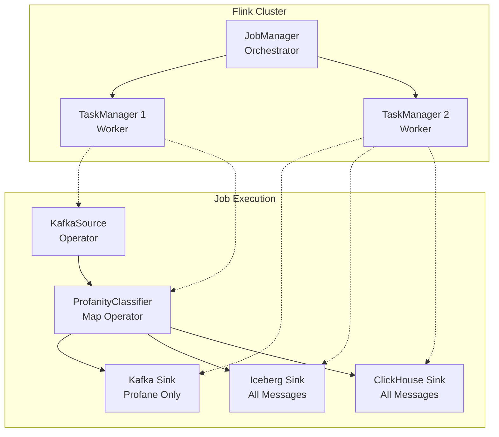
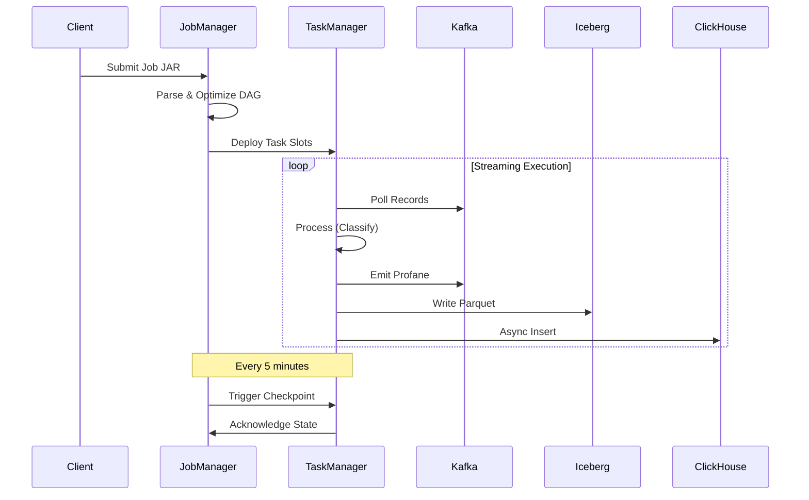
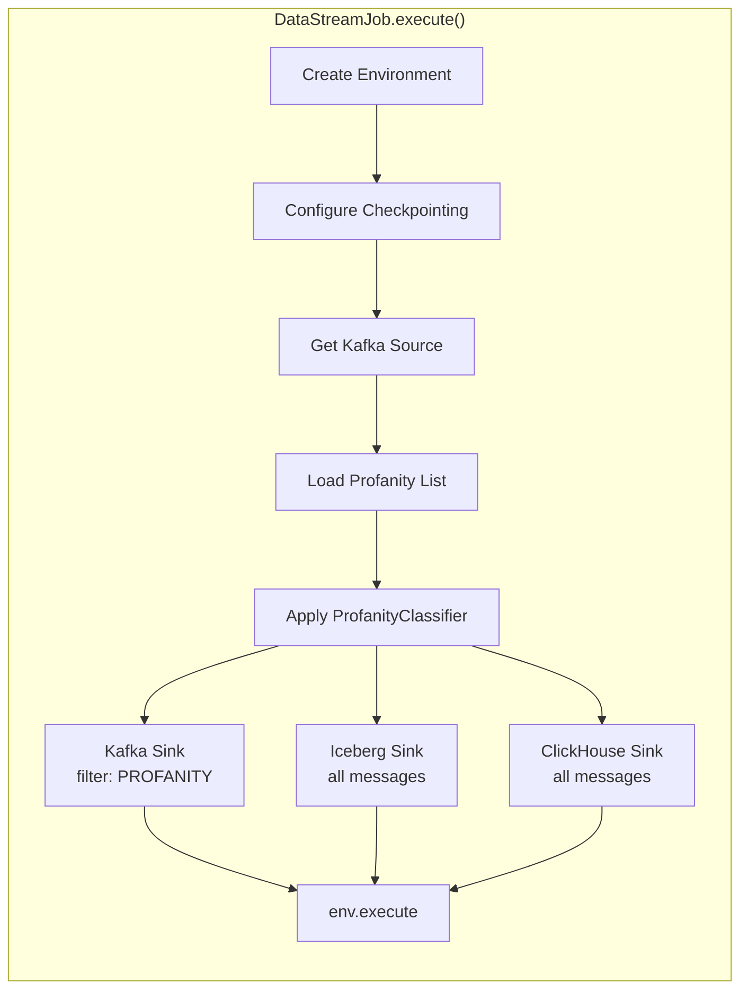
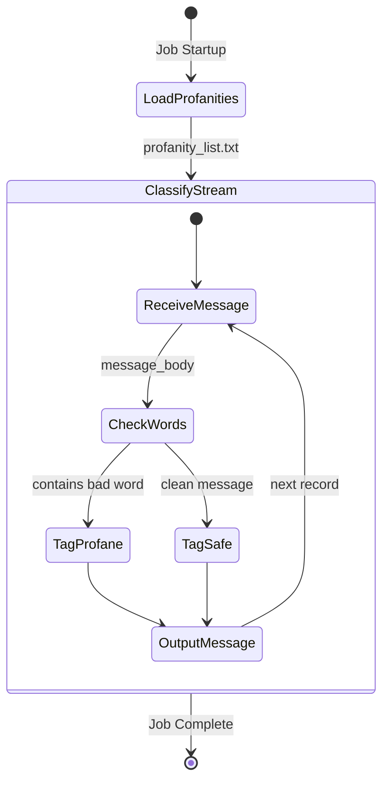
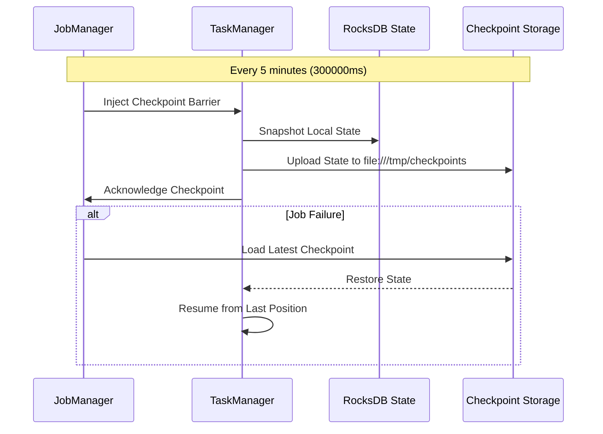
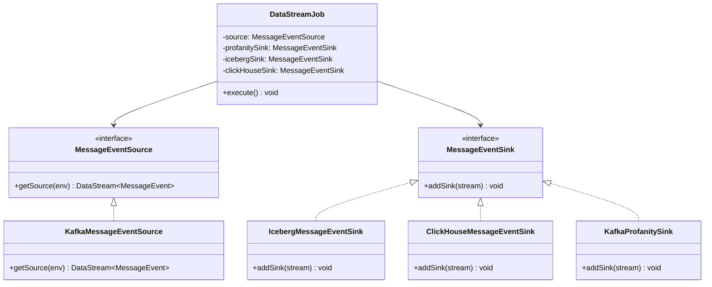

# Apache Flink - Stream Processing Deep Dive

## Table of Contents
1. [Overview](#overview)
2. [Flink Architecture](#flink-architecture)
3. [DataStreamJob Walkthrough](#datastreamjob-walkthrough)
4. [Profanity Classification](#profanity-classification)
5. [Checkpointing & Fault Tolerance](#checkpointing--fault-tolerance)
6. [Environment Configuration](#environment-configuration)
7. [Testing & Testability](#testing--testability)

---

## Overview

**Apache Flink** is the core stream processing engine in this pipeline. It provides:

- **Real-time Processing**: Sub-second latency for message classification
- **Exactly-Once Semantics**: Guaranteed message processing with checkpointing
- **Stateful Computations**: Maintains profanity word lists in memory
- **Multi-Sink Fan-Out**: Routes data to Kafka, Iceberg, and ClickHouse simultaneously



---

## Flink Architecture

### JobManager vs TaskManager



### Key Concepts

| Component | Role | Configuration |
|-----------|------|---------------|
| **JobManager** | Cluster coordinator, schedules tasks | Port 8081 (Web UI) |
| **TaskManager** | Executes operators, manages state | 2 task slots per container |
| **Task Slot** | Unit of parallelism | `taskmanager.numberOfTaskSlots: 2` |
| **Parallelism** | Concurrent operator instances | `parallelism.default: 2` |

---

## DataStreamJob Walkthrough

### Entry Point: `DataStreamJob.java`



### Constructor Design (Dependency Injection)

```java
public class DataStreamJob {
    private final MessageEventSource source;
    private final MessageEventSink profanitySink;
    private final MessageEventSink icebergSink;
    private final MessageEventSink clickHouseSink;

    // Production constructor - uses real implementations
    public DataStreamJob() {
        this(
            new KafkaMessageEventSource(),
            new KafkaProfanitySink(),
            new IcebergMessageEventSink(),
            new ClickHouseMessageEventSink()
        );
    }

    // Test constructor - allows mocking
    public DataStreamJob(MessageEventSource source, 
                         MessageEventSink profanitySink,
                         MessageEventSink icebergSink, 
                         MessageEventSink clickHouseSink) {
        this.source = source;
        this.profanitySink = profanitySink;
        this.icebergSink = icebergSink;
        this.clickHouseSink = clickHouseSink;
    }
}
```

**Why Dependency Injection?**
- **Testability**: Unit tests can inject mock sources/sinks
- **Flexibility**: Easy to swap implementations (e.g., Kinesis instead of Kafka)
- **Separation of Concerns**: Job logic is decoupled from infrastructure

---

## Profanity Classification

### Pipeline Flow



### ProfanityClassifier Implementation

```java
public class ProfanityClassifier implements MapFunction<MessageEvent, MessageEvent> {
    private final Set<String> profanities;

    public ProfanityClassifier(Set<String> profanities) {
        this.profanities = profanities;
    }

    @Override
    public MessageEvent map(MessageEvent event) {
        String body = event.getMessageBody().toLowerCase();
        boolean isProfane = profanities.stream()
            .anyMatch(word -> body.contains(word.toLowerCase()));
        
        event.setProfanityType(isProfane ? 
            MessageEvent.ProfanityType.PROFANITY : 
            MessageEvent.ProfanityType.SAFE);
        return event;
    }
}
```

### Profanity Word Loading

```java
public static Set<String> loadProfanities() {
    // 1. Try loading from classpath resource
    InputStream is = DataStreamJob.class
        .getClassLoader()
        .getResourceAsStream("profanity_list.txt");
    
    if (is != null) {
        // 2. Read lines, trim whitespace, filter empty
        return reader.lines()
            .map(String::trim)
            .filter(line -> !line.isEmpty())
            .collect(Collectors.toSet());
    } else {
        // 3. Fallback: default word for testing
        return Set.of("gun");
    }
}
```

**File Location:** `src/main/resources/profanity_list.txt`

---

## Checkpointing & Fault Tolerance

### Checkpoint Configuration



### Code Configuration

```java
private void configureEnvironment(StreamExecutionEnvironment env) {
    // State Backend Configuration
    Configuration config = new Configuration();
    config.set(StateBackendOptions.STATE_BACKEND, "rocksdb");
    config.set(CheckpointingOptions.CHECKPOINT_STORAGE, "filesystem");
    config.set(CheckpointingOptions.CHECKPOINTS_DIRECTORY, "file:///tmp/checkpoints");
    config.set(CheckpointingOptions.SAVEPOINT_DIRECTORY, "file:///tmp/savepoints");
    config.set(CheckpointingOptions.INCREMENTAL_CHECKPOINTS, true);
    
    env.configure(config);
    
    // Checkpointing Settings
    env.enableCheckpointing(300000);  // Every 5 minutes
    
    CheckpointConfig checkpointConfig = env.getCheckpointConfig();
    checkpointConfig.setCheckpointingConsistencyMode(CheckpointingMode.EXACTLY_ONCE);
    checkpointConfig.setMinPauseBetweenCheckpoints(60000);   // 1 minute minimum gap
    checkpointConfig.setCheckpointTimeout(600000);           // 10 minute timeout
    checkpointConfig.setMaxConcurrentCheckpoints(1);         // One at a time
    checkpointConfig.setTolerableCheckpointFailureNumber(3); // Allow 3 failures
}
```

### Checkpoint vs Savepoint

| Feature | Checkpoint | Savepoint |
|---------|------------|-----------|
| **Purpose** | Automatic fault tolerance | Manual job upgrades |
| **Trigger** | Periodic (every 5 min) | Manual command |
| **Format** | Optimized for speed | Portable, self-contained |
| **Use Case** | Recovery from failure | Schema changes, version upgrades |

---

## Environment Configuration

### Environment Variables

| Variable | Default | Description |
|----------|---------|-------------|
| `STATE_BACKEND` | `rocksdb` | State storage (rocksdb, hashmap) |
| `CHECKPOINT_STORAGE` | `filesystem` | Checkpoint storage type |
| `CHECKPOINTS_DIRECTORY` | `file:///tmp/checkpoints` | Checkpoint location |
| `SAVEPOINT_DIRECTORY` | `file:///tmp/savepoints` | Savepoint location |
| `CHECKPOINT_INTERVAL` | `300000` | Checkpoint interval (ms) |
| `MIN_PAUSE_BETWEEN_CHECKPOINTS` | `60000` | Minimum gap between checkpoints |
| `JOB_NAME` | `Flink_Iceberg_Integration_Job` | Job name in Flink UI |

### Docker Environment (Flink Container)

```yaml
flink:
  environment:
    - |
      FLINK_PROPERTIES=
      jobmanager.rpc.address: jobmanager
      parallelism.default: 2
      state.backend: rocksdb
      state.checkpoints.dir: file:///tmp/checkpoints
      state.savepoints.dir: file:///tmp/savepoints
    - POLARIS_URI=http://polaris:8181/api/catalog
    - KAFKA_BOOTSTRAP_SERVERS=broker:29092
    - CLICKHOUSE_JDBC_URL=http://clickhouse:8123
```

---

## Testing & Testability

### Interface-Based Design



### Unit Testing Example

```java
@Test
void testProfanityClassification() {
    // Arrange
    Set<String> profanities = Set.of("gun", "weapon");
    ProfanityClassifier classifier = new ProfanityClassifier(profanities);
    
    MessageEvent event = new MessageEvent();
    event.setMessageBody("This message mentions a gun");
    
    // Act
    MessageEvent result = classifier.map(event);
    
    // Assert
    assertEquals(MessageEvent.ProfanityType.PROFANITY, result.getProfanityType());
}

@Test
void testSafeMessage() {
    Set<String> profanities = Set.of("gun", "weapon");
    ProfanityClassifier classifier = new ProfanityClassifier(profanities);
    
    MessageEvent event = new MessageEvent();
    event.setMessageBody("Hello world, this is safe");
    
    MessageEvent result = classifier.map(event);
    
    assertEquals(MessageEvent.ProfanityType.SAFE, result.getProfanityType());
}
```

---

## Troubleshooting

### Common Issues

| Issue | Symptoms | Solution |
|-------|----------|----------|
| **Job not starting** | No tasks in Flink UI | Check `docker logs jobmanager` for errors |
| **Checkpoint failures** | Warnings in logs | Increase `checkpointTimeout` or reduce state size |
| **No data processed** | Metrics show 0 records | Verify Kafka has data: `kafka-console-consumer` |
| **Out of Memory** | TaskManager OOM | Increase container memory or reduce parallelism |

### Useful Commands

```bash
# View Flink Web UI
open http://localhost:8081

# Check JobManager logs
docker logs -f jobmanager

# Check TaskManager logs
docker logs -f taskmanager

# Cancel a running job
curl -X PATCH http://localhost:8081/jobs/{job-id}?mode=cancel

# Trigger savepoint
curl -X POST http://localhost:8081/jobs/{job-id}/savepoints -d '{"target-directory":"/tmp/savepoints"}'
```

---

*This documentation is part of the Real-Time Profanity Filtering Pipeline project.*
