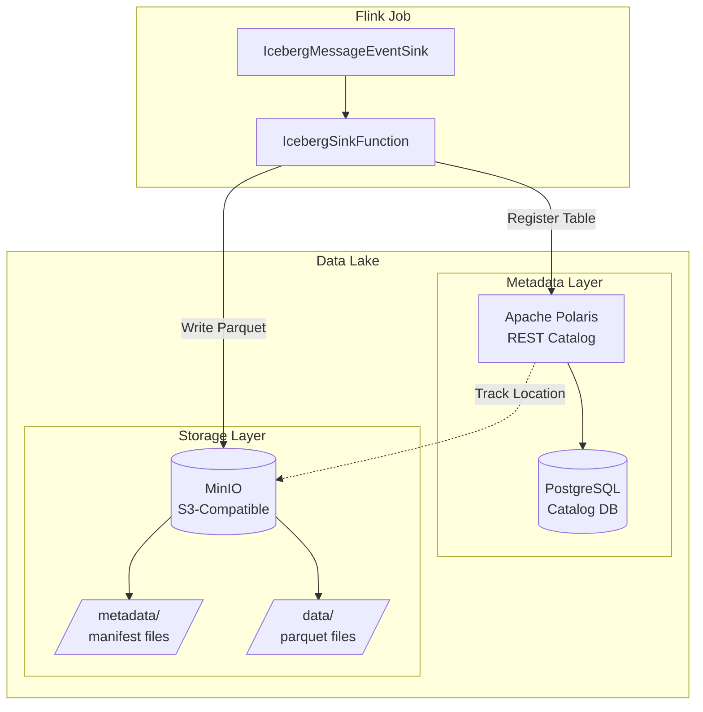
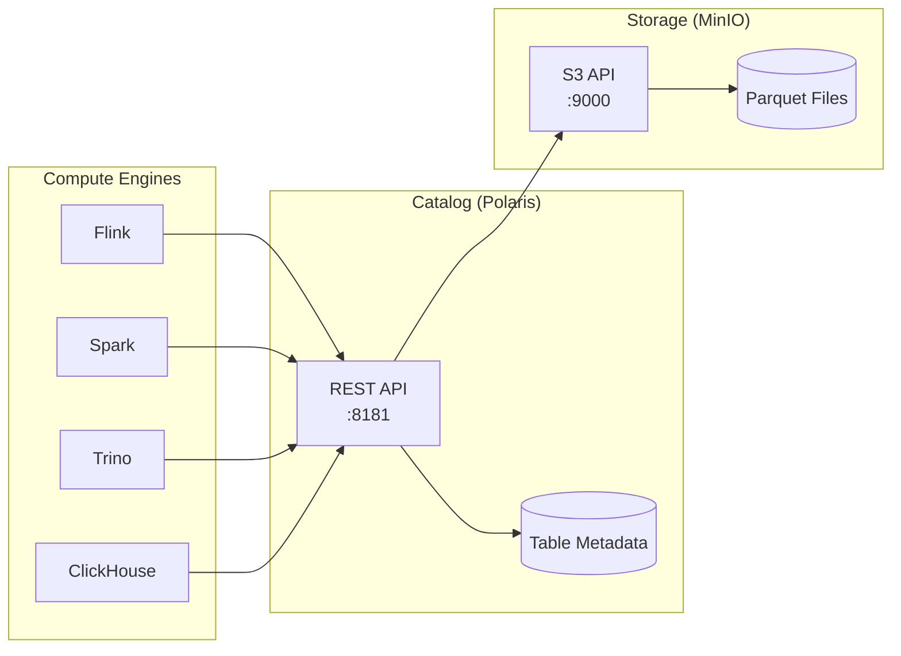
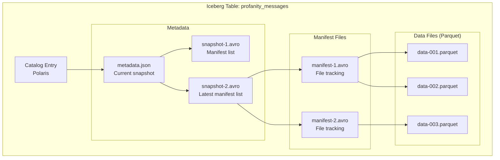
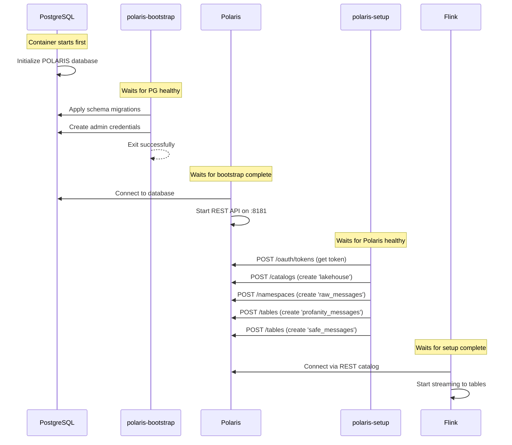
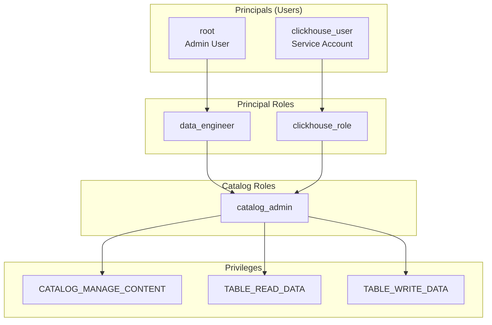
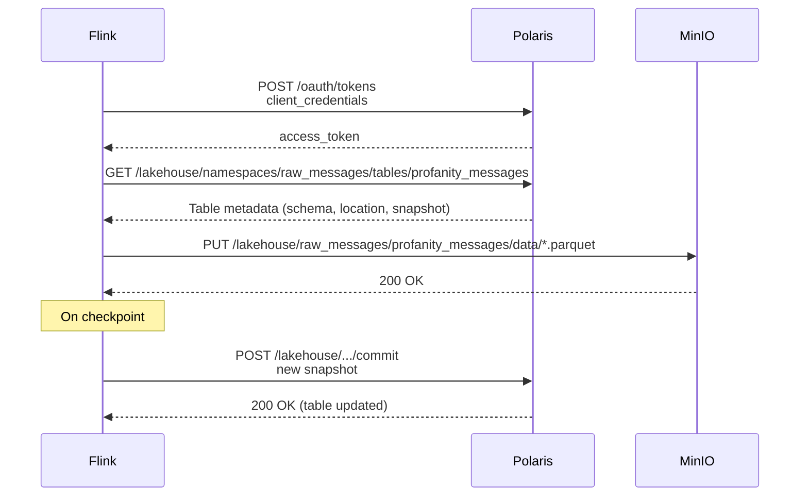
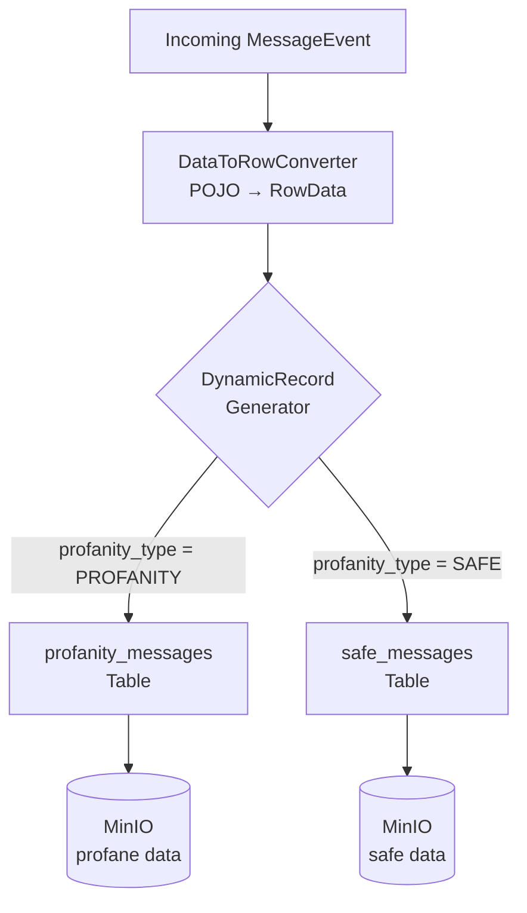

# Apache Iceberg & MinIO - Data Lake Deep Dive

> 📖 **See Also**: [Apache Polaris Catalog Documentation](../polaris/README-POLARIS.md) for in-depth coverage of the catalog service.

## Table of Contents
1. [Overview](#overview)
2. [Data Lake Architecture](#data-lake-architecture)
3. [Apache Iceberg Fundamentals](#apache-iceberg-fundamentals)
4. [Apache Polaris Catalog Overview](#apache-polaris-catalog-overview)
5. [MinIO Object Storage](#minio-object-storage)
6. [Flink Integration](#flink-integration)
7. [Dynamic Routing Implementation](#dynamic-routing-implementation)
8. [Schema & Partitioning](#schema--partitioning)
9. [Configuration Reference](#configuration-reference)

---

## Overview

This pipeline uses a modern **Data Lake** architecture consisting of three components:

| Component | Role | Why |
|-----------|------|-----|
| **Apache Iceberg** | Table format | ACID transactions, schema evolution, time travel |
| **Apache Polaris** | Catalog service | Vendor-neutral REST API for table metadata |
| **MinIO** | Object storage | S3-compatible local storage for Parquet files |



---

## Data Lake Architecture

### Separation of Concerns



**Benefits:**
- **Multi-Engine Access**: Same tables readable by Flink, Spark, Trino, ClickHouse
- **Decoupled Scaling**: Scale compute independently from storage
- **Vendor Neutral**: No lock-in to specific cloud or engine

---

## Apache Iceberg Fundamentals

### What is Iceberg?

Apache Iceberg is a **table format** (not a database or engine) that sits between compute engines and storage. It provides:

1. **ACID Transactions**: Atomic writes, no partial results
2. **Schema Evolution**: Add/remove/rename columns without rewriting data
3. **Time Travel**: Query historical versions of data
4. **Partition Evolution**: Change partitioning strategy without rewriting
5. **Hidden Partitioning**: No need to know partition columns to query

### Iceberg Table Structure



### File Layout in MinIO

```
s3://lakehouse/
└── raw_messages/
    ├── profanity_messages/
    │   ├── metadata/
    │   │   ├── v1.metadata.json
    │   │   ├── v2.metadata.json
    │   │   └── snap-*.avro
    │   └── data/
    │       ├── timestamp_day=2025-01-15/
    │       │   ├── 00000-0-*.parquet
    │       │   └── 00001-0-*.parquet
    │       └── timestamp_day=2025-01-16/
    │           └── 00000-0-*.parquet
    └── safe_messages/
        ├── metadata/
        └── data/
```

---

## Apache Polaris Catalog Overview

> 📖 **For complete Polaris documentation**, see [README-POLARIS.md](../polaris/README-POLARIS.md)

### What is Polaris?

**Apache Polaris** is an open-source implementation of the Iceberg REST Catalog specification. It provides:

- **Centralized Metadata**: Single source of truth for all Iceberg tables
- **REST API**: Standard HTTP interface for table operations
- **OAuth2 Security**: Token-based authentication
- **RBAC**: Role-based access control for catalogs and tables

**Quick Summary:**
- Polaris stores table metadata in PostgreSQL
- Exposes REST API on port 8181
- Tracks file locations in MinIO/S3
- Handles authentication and authorization

For details on OAuth2 flow, RBAC configuration, API endpoints, and troubleshooting, refer to the [dedicated Polaris documentation](../polaris/README-POLARIS.md).

### Polaris Startup Sequence



### Polaris API Reference

> 📖 See [README-POLARIS.md - REST Catalog API](../polaris/README-POLARIS.md#rest-catalog-api) for complete API documentation with examples.

| Endpoint | Method | Purpose |
|----------|--------|---------|
| `/api/catalog/v1/oauth/tokens` | POST | OAuth2 token exchange |
| `/api/management/v1/catalogs` | POST | Create catalog |
| `/api/catalog/v1/{catalog}/namespaces` | POST | Create namespace |
| `/api/catalog/v1/{catalog}/namespaces/{ns}/tables` | POST | Create table |
| `/api/catalog/v1/{catalog}/namespaces/{ns}/tables/{table}` | GET | Get table metadata |

### RBAC Configuration

> 📖 See [README-POLARIS.md - RBAC & Permissions](../polaris/README-POLARIS.md#rbac--permissions) for detailed permission model.



---

## MinIO Object Storage

### Configuration

MinIO provides S3-compatible object storage for Iceberg data files:

```yaml
minio:
  image: minio/minio:latest
  environment:
    MINIO_ROOT_USER: admin
    MINIO_ROOT_PASSWORD: password
  command: ["server", "/data", "--console-address", ":9001"]
  ports:
    - "9000:9000"   # S3 API
    - "9001:9001"   # Console UI
```

### Bucket Setup

```bash
# Create lakehouse bucket for Iceberg tables
mc mb minio/lakehouse

# Set public access (for local dev only!)
mc anonymous set public minio/lakehouse
```

### Accessing Data

| Interface | URL | Credentials |
|-----------|-----|-------------|
| S3 API | `http://localhost:9000` | admin / password |
| Web Console | `http://localhost:9001` | admin / password |

---

## Flink Integration

### IcebergMessageEventSink.java

This class configures the connection between Flink and the Iceberg/Polaris/MinIO stack:

```java
public void addSink(DataStream<MessageEvent> stream) {
    // Catalog configuration
    Map<String, String> catalogProps = new HashMap<>();
    catalogProps.put("uri", "http://polaris:8181/api/catalog");
    catalogProps.put("credential", "admin:password");
    catalogProps.put("warehouse", "lakehouse");
    catalogProps.put("scope", "PRINCIPAL_ROLE:ALL");
    
    // S3/MinIO configuration
    catalogProps.put("s3.endpoint", "http://minio:9000");
    catalogProps.put("s3.access-key-id", "admin");
    catalogProps.put("s3.secret-access-key", "password");
    catalogProps.put("s3.path-style-access", "true");
    
    // OAuth2 configuration
    catalogProps.put("rest.auth.type", "oauth2");
    catalogProps.put("oauth2-server-uri", 
        "http://polaris:8181/api/catalog/v1/oauth/tokens");
    
    // IO implementation
    catalogProps.put("io-impl", 
        "org.apache.iceberg.aws.s3.S3FileIO");
}
```

### Connection Flow



---

## Dynamic Routing Implementation

### IcebergSinkFunction.java

The key innovation is **dynamic table routing** based on message content:

```java
// Define schema for all tables
private static final Schema FILTERED_MESSAGE_SCHEMA = new Schema(
    Types.NestedField.optional(1, "account_id", Types.StringType.get()),
    Types.NestedField.optional(2, "message_id", Types.StringType.get()),
    Types.NestedField.optional(3, "message_body", Types.StringType.get()),
    Types.NestedField.optional(4, "correlation_id", Types.StringType.get()),
    Types.NestedField.optional(5, "message_status", Types.StringType.get()),
    Types.NestedField.optional(6, "timestamp", Types.TimestampType.withoutZone()),
    Types.NestedField.optional(7, "profanity_type", Types.StringType.get())
);

// Dynamic routing generator
DynamicIcebergSink.forInput(rowDataStream)
  .generator((row, out) -> {
    String profanityType = row.getString(6).toString();
    
    // Route based on classification
    String tableName = "PROFANITY".equals(profanityType) 
        ? "profanity_messages" 
        : "safe_messages";
    
    out.collect(new DynamicRecord(
      TableIdentifier.of(namespace, tableName),
      branch,
      FILTERED_MESSAGE_SCHEMA,
      row,
      partitionSpec,
      DistributionMode.HASH,
      1  // sort order ID
    ));
  })
  .catalogLoader(CatalogLoader.rest(catalogName, new Configuration(), catalogProps))
  .writeParallelism(writeParallelism)
  .immediateTableUpdate(true)
```

### Routing Diagram



---

## Schema & Partitioning

### Table Schema

Both `profanity_messages` and `safe_messages` share this schema:

| Column | Iceberg Type | Description |
|--------|--------------|-------------|
| `account_id` | string | User account identifier |
| `message_id` | string | Unique message ID |
| `message_body` | string | Message text content |
| `correlation_id` | string | Request correlation ID |
| `message_status` | string | Delivery status |
| `timestamp` | timestamp | Event time (no timezone) |
| `profanity_type` | string | PROFANITY or SAFE |

### Partition Strategy

Tables are partitioned by `day(timestamp)`:

```java
PartitionSpec partitionSpec = PartitionSpec.builderFor(FILTERED_MESSAGE_SCHEMA)
    .day("timestamp")
    .build();
```

**Benefits:**
- Efficient time-range queries
- Automatic file organization by date
- Predictable file sizes per day

**File Layout:**
```
profanity_messages/data/
├── timestamp_day=2025-01-15/
│   └── 00000-0-xxx.parquet
└── timestamp_day=2025-01-16/
    └── 00000-0-yyy.parquet
```

---

## Configuration Reference

### Environment Variables

| Variable | Default | Description |
|----------|---------|-------------|
| `CATALOG_NAME` | `polaris` | Iceberg catalog name |
| `POLARIS_URI` | `http://polaris:8181/api/catalog` | Polaris REST endpoint |
| `POLARIS_CREDENTIAL` | `admin:password` | OAuth2 client credentials |
| `POLARIS_WAREHOUSE` | `lakehouse` | Iceberg warehouse name |
| `POLARIS_SCOPE` | `PRINCIPAL_ROLE:ALL` | OAuth2 scope |
| `S3_ENDPOINT` | `http://minio:9000` | MinIO S3 endpoint |
| `S3_ACCESS_KEY` | `admin` | MinIO access key |
| `S3_SECRET_KEY` | `password` | MinIO secret key |
| `S3_PATH_STYLE_ACCESS` | `true` | Use path-style URLs |
| `CLIENT_REGION` | `us-east-1` | AWS region (dummy for MinIO) |
| `ICEBERG_NAMESPACE` | `raw_data` | Iceberg namespace |
| `ICEBERG_BRANCH` | `main` | Iceberg branch |
| `WRITE_PARALLELISM` | `1` | Sink parallelism |
| `ICEBERG_TARGET_FILE_SIZE_BYTES` | `134217728` | Target file size (128MB) |
| `ICEBERG_DISTRIBUTION_MODE` | `HASH` | Distribution mode |

### Troubleshooting

| Issue | Cause | Solution |
|-------|-------|----------|
| **401 Unauthorized** | Invalid OAuth token | Check `POLARIS_CREDENTIAL` |
| **Table not found** | Table not created | Run `polaris-setup` again |
| **S3 connection error** | Wrong MinIO endpoint | Verify `S3_ENDPOINT` |
| **No data in MinIO** | Checkpoint not triggered | Wait 5 minutes or trigger savepoint |

---

*This documentation is part of the Real-Time Profanity Filtering Pipeline project.*
