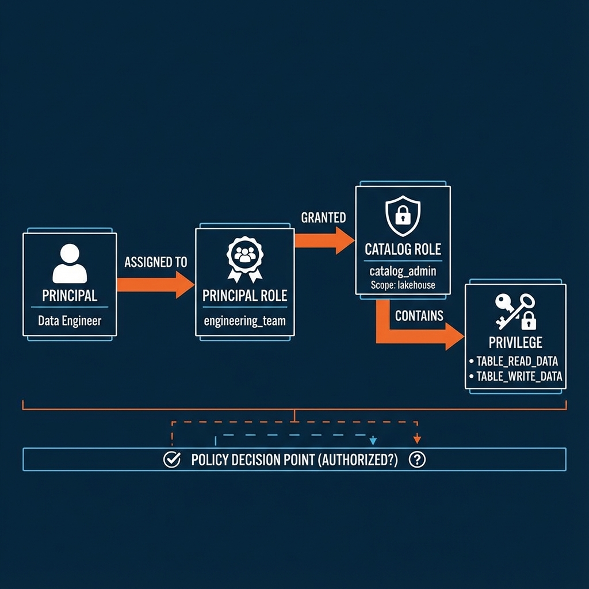

# Apache Polaris Governance: The Nitty Gritty

> **Governance** in Polaris means: **Centralized Control** over **Decentralized Data**.

## The Architecture of Control (RBAC)

Polaris enforces security not by user lists, but by a chain of trust.

## Core Concepts (Validated)

1.  **Securable Object**: The "Thing" being protected (Catalog, Namespace, Table, View).
2.  **Privilege**: The "Action" allowed (e.g., `TABLE_READ_DATA`, `CATALOG_MANAGE_CONTENT`).
3.  **Catalog Role**: A "Keyset" valid *only* within a specific Catalog.
4.  **Principal Role**: A "Job Title" (e.g., `data_engineer`) assigned to users/services.
5.  **Principal**: The "Actor" (User, Service, Application).

## How to Achieve Governance

To achieve true governance, you must decouple **Who** from **What**.

### 1. Define the Scope (Catalog Role)
*   **Don't** assign rights to users.
*   **Do** create a `catalog_admin` role scoped to `lakehouse`.
*   **Grant**: `CATALOG_MANAGE_CONTENT` → `catalog_admin`.

### 2. Define the Function (Principal Role)
*   **Don't** manage individuals.
*   **Do** create an `engineering_team` role.
*   **Assign**: `catalog_admin` → `engineering_team`.

### 3. Assign the Actor (Principal)
*   **Action**: Assign `engineering_team` → `waqas_user`.
*   **Result**: Waqas inherits access to `lakehouse` without direct grants.

## The Governance Flow (Internal Check)

When Flink tries to write a file:
1.  **Request**: `PUT /namespaces/raw_messages/tables/profanity_messages`
2.  **AuthZ Check**: Does `flink_service` have `TABLE_WRITE_DATA`?
3.  **Traverse**: `flink_service` → `data_writer_role` → `catalog_writer_role` → `TABLE_WRITE_DATA`.
4.  **Decision**: **ALLOW**.

## Why This Matters (Adoption)
*   **Auditability**: You check one role to see who has access.
*   **Scalability**: Onboard new engineers by assigning one role, not 50 table grants.
*   **Isolation**: A compromised `analyst` role cannot touch `production_write` privileges.
