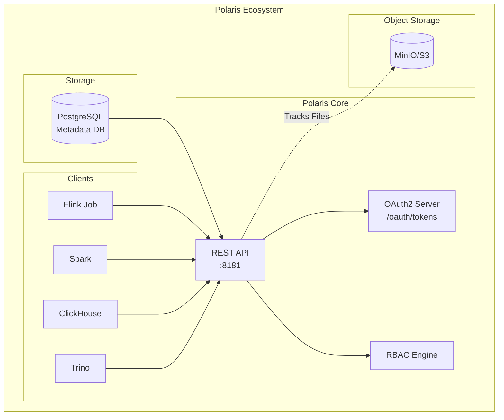
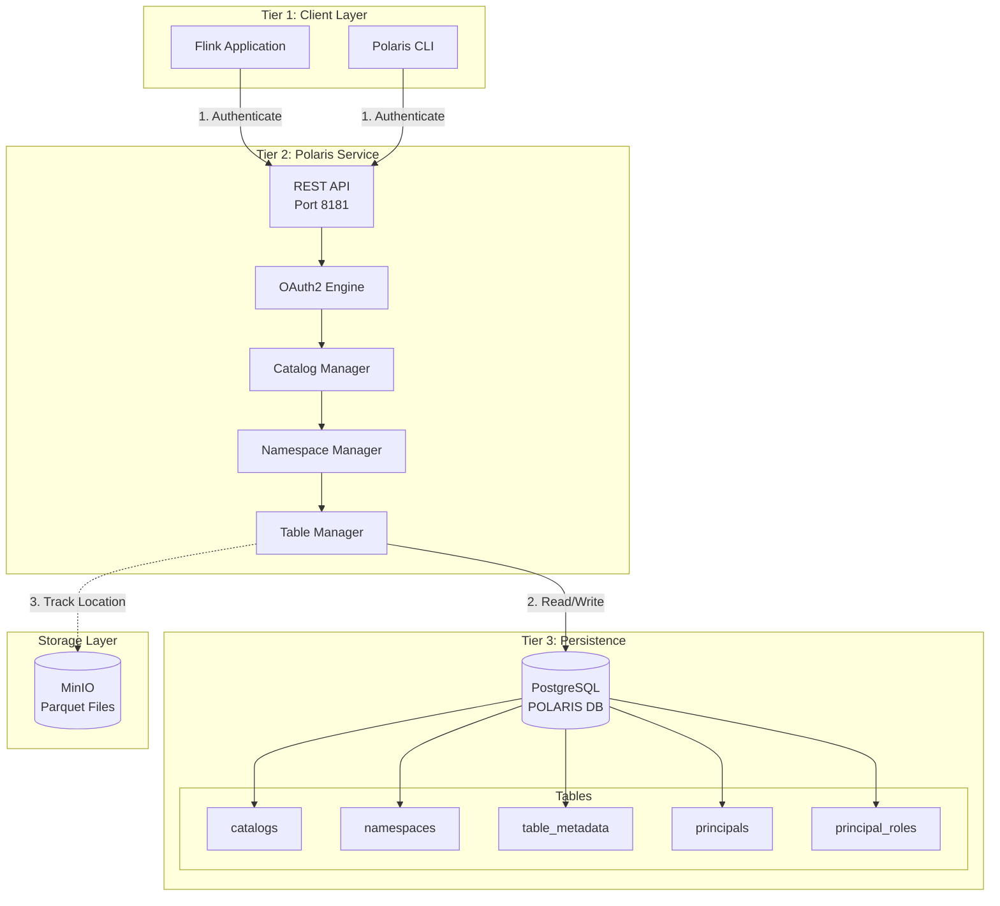
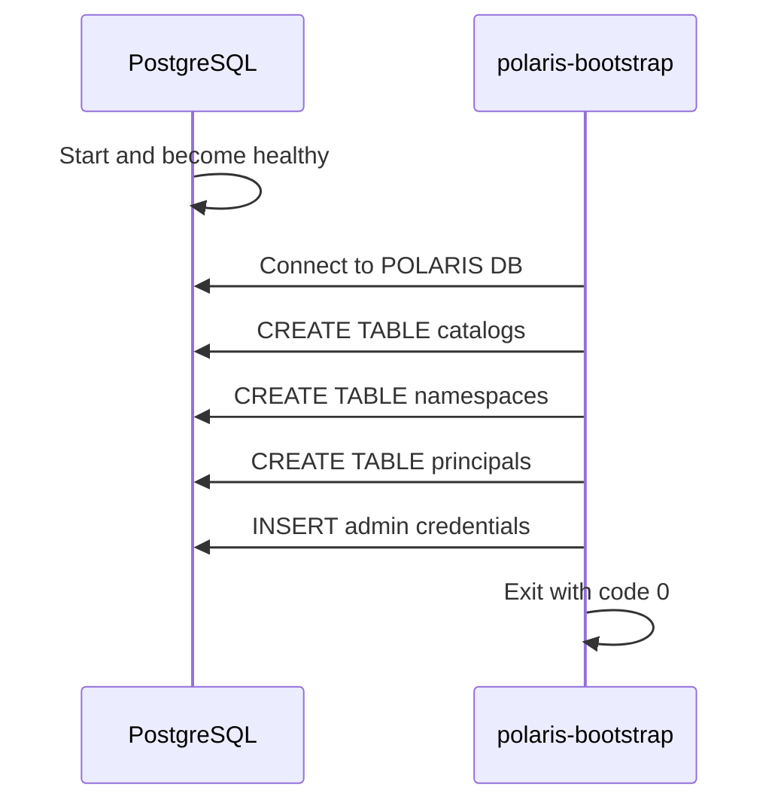
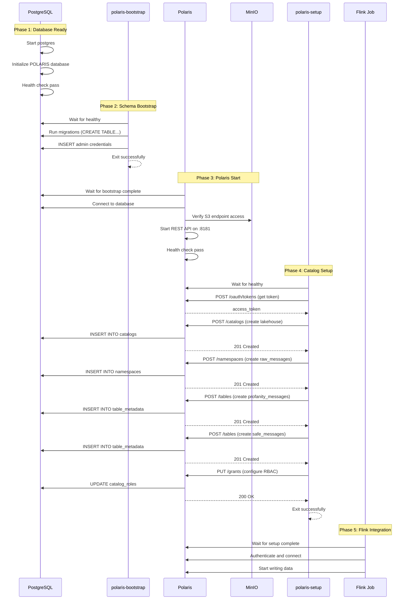
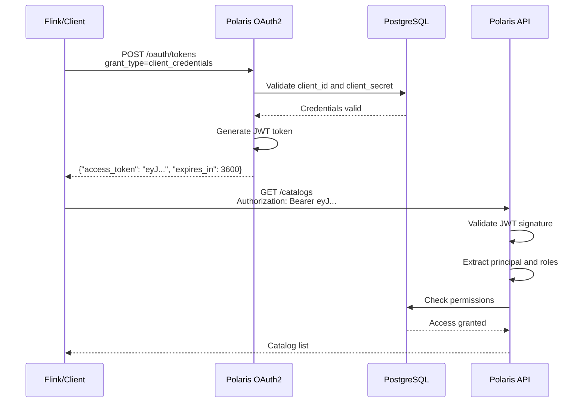
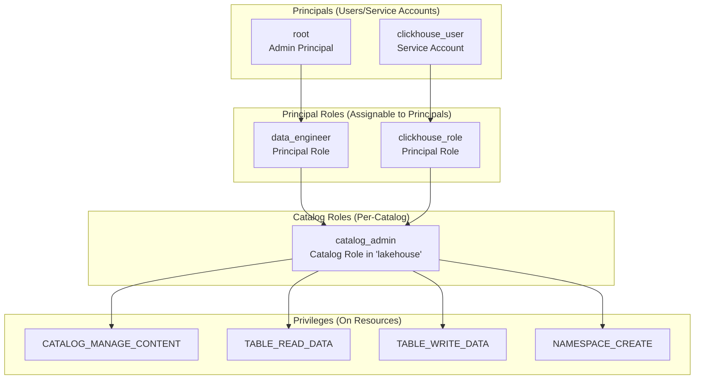
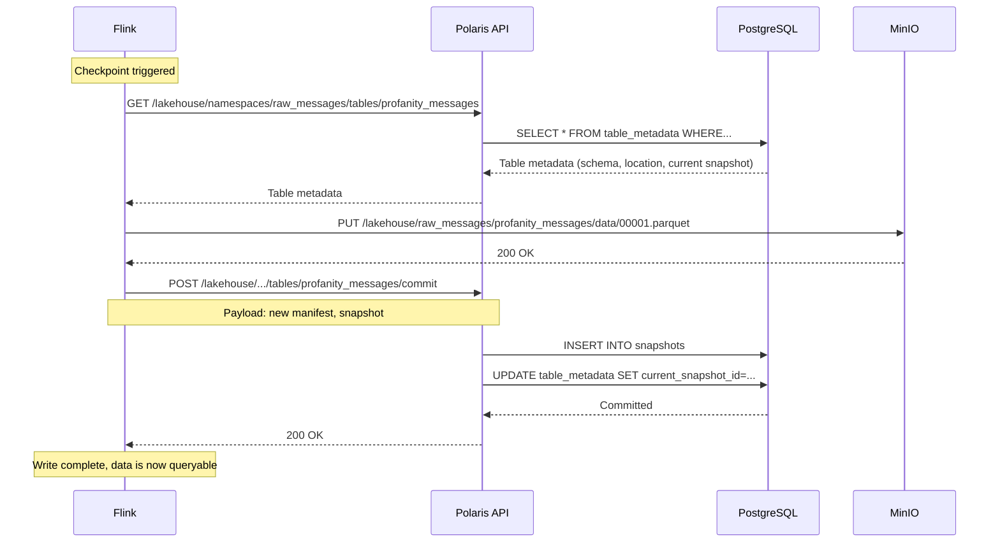

# Apache Polaris Catalog - Deep Dive

## Table of Contents
1. [Overview](#overview)
2. [What is Apache Polaris?](#what-is-apache-polaris)
3. [Architecture](#architecture)
4. [Polaris Components](#polaris-components)
5. [Startup & Bootstrap Process](#startup--bootstrap-process)
6. [REST Catalog API](#rest-catalog-api)
7. [OAuth2 Authentication](#oauth2-authentication)
8. [RBAC & Permissions](#rbac--permissions)
9. [Catalog Structure](#catalog-structure)
10. [Integration with Flink](#integration-with-flink)
11. [Configuration Reference](#configuration-reference)
12. [Troubleshooting](#troubleshooting)

---

## Overview

**Apache Polaris** is the cornerstone of the Iceberg-based data lake in this pipeline. It acts as the **metadata catalog** that tracks all Iceberg tables, their schemas, locations, and snapshots.



**Key Benefits:**
- **Vendor Neutral**: Works with any compute engine (Flink, Spark, Trino)
- **Open Standard**: Implements Iceberg REST Catalog specification
- **Centralized**: Single source of truth for all table metadata
- **Secure**: OAuth2 authentication and fine-grained RBAC
- **Scalable**: Backed by PostgreSQL for production workloads

---

## What is Apache Polaris?

Apache Polaris is an **open-source catalog service** for Apache Iceberg tables. It was originally developed by Snowflake and donated to the Apache Software Foundation.

### Polaris vs Other Catalogs

| Feature | **Polaris** | Hive Metastore | AWS Glue | Nessie |
|---------|-------------|----------------|----------|--------|
| **REST API** | ✅ Yes | ❌ No (Thrift) | ✅ Yes | ✅ Yes |
| **OAuth2** | ✅ Yes | ❌ No | ✅ Yes (IAM) | ❌ No |
| **Open Source** | ✅ Yes | ✅ Yes | ❌ No | ✅ Yes |
| **Multi-Engine** | ✅ Yes | ✅ Yes | ⚠️ AWS Only | ✅ Yes |
| **RBAC** | ✅ Fine-grained | ⚠️ Basic | ✅ IAM | ⚠️ Basic |
| **Git-like Versioning** | ❌ No | ❌ No | ❌ No | ✅ Yes |

### Why Polaris for This Project?

1. **Standardized REST API**: Easy integration with Flink, Spark, and ClickHouse
2. **Local Development**: Runs in Docker without cloud dependencies
3. **Production-Ready**: Used by Snowflake's Polaris Catalog service
4. **Active Development**: Apache project with strong community

---

## Architecture

### Three-Tier Architecture



---

## Polaris Components

### 1. PostgreSQL Backend

```yaml
postgres:
  image: postgres:14.17
  environment:
    POSTGRES_DB: POLARIS
    POSTGRES_USER: postgres
    POSTGRES_PASSWORD: postgres
  volumes:
    - postgres-data:/var/lib/postgresql/data
```

**Purpose**: Stores all Polaris metadata
- Catalog definitions
- Namespace hierarchies
- Table schemas and snapshots
- User principals and roles
- Access control policies

**Schema Tables:**
```sql
-- Key tables in POLARIS database
catalogs          -- Catalog definitions (lakehouse)
namespaces        -- Namespace hierarchies (raw_messages)
table_metadata    -- Iceberg table schemas
table_identifier  -- Table name mappings
principals        -- Users and service accounts
principal_roles   -- Role assignments
catalog_roles     -- Role definitions per catalog
```

### 2. Polaris Bootstrap

```yaml
polaris-bootstrap:
  image: apache/polaris-admin-tool:latest
  command:
    - "bootstrap"
    - "--realm=default"
    - "--credential=default,admin,password"
```

**Purpose**: One-time database initialization
- Creates schema tables in PostgreSQL
- Initializes admin credentials (`admin:password`)
- Sets up default realm (`default`)
- Runs database migrations

**Flow:**


### 3. Polaris Server

```yaml
polaris:
  image: apache/polaris:latest
  ports:
    - "8181:8181"  # REST API
    - "8182:8182"  # Health/Metrics
  environment:
    POLARIS_PERSISTENCE_TYPE: relational-jdbc
    QUARKUS_DATASOURCE_JDBC_URL: jdbc:postgresql://postgres:5432/POLARIS
    POLARIS_BOOTSTRAP_CREDENTIALS: default,admin,password
    AWS_ACCESS_KEY_ID: admin
    AWS_SECRET_ACCESS_KEY: password
    AWS_ENDPOINT_URL_S3: http://minio:9000
```

**Purpose**: Main REST API service
- Exposes Iceberg REST Catalog API
- Handles OAuth2 authentication
- Manages RBAC permissions
- Validates table operations

**Port Details:**
- **8181**: REST API for catalog operations
- **8182**: Health checks and Prometheus metrics

### 4. Polaris Setup

```yaml
polaris-setup:
  image: alpine/curl
  depends_on:
    polaris:
      condition: service_healthy
```

**Purpose**: Automated catalog configuration
- Creates `lakehouse` catalog
- Creates `raw_messages` namespace
- Creates `profanity_messages` table
- Creates `safe_messages` table
- Configures RBAC roles and permissions

---

## Startup & Bootstrap Process

### Complete Initialization Flow



---

## REST Catalog API

### Core API Endpoints

| Endpoint | Method | Purpose | Example |
|----------|--------|---------|---------|
| `/api/catalog/v1/oauth/tokens` | POST | Get OAuth2 token | Auth header for all requests |
| `/api/management/v1/catalogs` | POST | Create catalog | Create `lakehouse` |
| `/api/catalog/v1/{catalog}/config` | GET | Get catalog config | Retrieve S3 settings |
| `/api/catalog/v1/{catalog}/namespaces` | POST | Create namespace | Create `raw_messages` |
| `/api/catalog/v1/{catalog}/namespaces/{ns}/tables` | POST | Create table | Create `profanity_messages` |
| `/api/catalog/v1/{catalog}/namespaces/{ns}/tables/{table}` | GET | Get table metadata | Retrieve schema, location |
| `/api/catalog/v1/{catalog}/namespaces/{ns}/tables/{table}` | POST | Commit changes | Update snapshot |
| `/api/management/v1/catalogs/{catalog}/catalog-roles/{role}/grants` | PUT | Grant permission | Allow TABLE_WRITE_DATA |

### Example: Create Catalog

```bash
# 1. Get OAuth token
TOKEN=$(curl -s -X POST http://polaris:8181/api/catalog/v1/oauth/tokens \
  -H 'Content-Type: application/x-www-form-urlencoded' \
  -d "grant_type=client_credentials&client_id=admin&client_secret=password&scope=PRINCIPAL_ROLE:ALL" \
  | jq -r '.access_token')

# 2. Create catalog
curl -X POST http://polaris:8181/api/management/v1/catalogs \
  -H "Authorization: Bearer $TOKEN" \
  -H "Content-Type: application/json" \
  -d '{
    "catalog": {
      "name": "lakehouse",
      "type": "INTERNAL",
      "properties": {
        "default-base-location": "s3://lakehouse"
      },
      "storageConfigInfo": {
        "storageType": "S3",
        "allowedLocations": ["s3://lakehouse/*"],
        "region": "us-east-1",
        "endpoint": "http://minio:9000",
        "pathStyleAccess": true
      }
    }
  }'
```

### Example: Create Table

```bash
curl -X POST http://polaris:8181/api/catalog/v1/lakehouse/namespaces/raw_messages/tables \
  -H "Authorization: Bearer $TOKEN" \
  -H "Content-Type: application/json" \
  -d '{
    "name": "profanity_messages",
    "schema": {
      "type": "struct",
      "fields": [
        {"id": 1, "name": "account_id", "required": false, "type": "string"},
        {"id": 2, "name": "message_id", "required": false, "type": "string"},
        {"id": 3, "name": "message_body", "required": false, "type": "string"},
        {"id": 4, "name": "correlation_id", "required": false, "type": "string"},
        {"id": 5, "name": "message_status", "required": false, "type": "string"},
        {"id": 6, "name": "timestamp", "required": false, "type": "timestamp"},
        {"id": 7, "name": "profanity_type", "required": false, "type": "string"}
      ]
    },
    "spec": {
      "fields": [
        {
          "name": "timestamp_day",
          "transform": "day",
          "source-id": 6
        }
      ]
    }
  }'
```

---

## OAuth2 Authentication

### Authentication Flow



### Token Request

```bash
curl -X POST http://polaris:8181/api/catalog/v1/oauth/tokens \
  -H 'Content-Type: application/x-www-form-urlencoded' \
  -d 'grant_type=client_credentials' \
  -d 'client_id=admin' \
  -d 'client_secret=password' \
  -d 'scope=PRINCIPAL_ROLE:ALL'
```

**Response:**
```json
{
  "access_token": "eyJhbGciOiJSUzI1NiIsInR5cCI6IkpXVCJ9...",
  "token_type": "bearer",
  "expires_in": 3600,
  "scope": "PRINCIPAL_ROLE:ALL"
}
```

### Token Usage in Flink

```java
// From IcebergMessageEventSink.java
Map<String, String> catalogProps = new HashMap<>();
catalogProps.put("uri", "http://polaris:8181/api/catalog");
catalogProps.put("credential", "admin:password");  // client_id:client_secret
catalogProps.put("scope", "PRINCIPAL_ROLE:ALL");
catalogProps.put("rest.auth.type", "oauth2");
catalogProps.put("oauth2-server-uri", "http://polaris:8181/api/catalog/v1/oauth/tokens");
```

**Flink automatically**:
1. Requests token using `credential`
2. Includes token in Authorization header
3. Refreshes token before expiration

---

## RBAC & Permissions

### Permission Model



### Permission Types

| Privilege | Level | Description |
|-----------|-------|-------------|
| `CATALOG_MANAGE_CONTENT` | Catalog | Create/drop namespaces and tables |
| `CATALOG_MANAGE_METADATA` | Catalog | Update catalog properties |
| `NAMESPACE_CREATE` | Namespace | Create tables in namespace |
| `NAMESPACE_DROP` | Namespace | Drop namespace |
| `TABLE_READ_DATA` | Table | Read table data |
| `TABLE_WRITE_DATA` | Table | Write/update table data |
| `TABLE_CREATE` | Table | Create table |
| `TABLE_DROP` | Table | Drop table |
| `VIEW_CREATE` | View | Create view |

### Setup Script (from polaris-setup)

```bash
# 1. Create principal role
curl -X POST http://polaris:8181/api/management/v1/principal-roles \
  -H "Authorization: Bearer $TOKEN" \
  -d '{"name": "data_engineer"}'

# 2. Grant catalog privileges to catalog_admin role
curl -X PUT http://polaris:8181/api/management/v1/catalogs/lakehouse/catalog-roles/catalog_admin/grants \
  -H "Authorization: Bearer $TOKEN" \
  -d '{"type": "catalog", "privilege": "CATALOG_MANAGE_CONTENT"}'

curl -X PUT http://polaris:8181/api/management/v1/catalogs/lakehouse/catalog-roles/catalog_admin/grants \
  -H "Authorization: Bearer $TOKEN" \
  -d '{"type": "catalog", "privilege": "TABLE_WRITE_DATA"}'

# 3. Assign catalog_admin to data_engineer
curl -X PUT http://polaris:8181/api/management/v1/principal-roles/data_engineer/catalog-roles/lakehouse \
  -H "Authorization: Bearer $TOKEN" \
  -d '{"name": "catalog_admin"}'

# 4. Assign data_engineer role to root principal
curl -X PUT http://polaris:8181/api/management/v1/principals/root/principal-roles \
  -H "Authorization: Bearer $TOKEN" \
  -d '{"name": "data_engineer"}'
```

---

## Catalog Structure

### Hierarchy

```
Polaris Instance
└── Realm: default
    └── Catalog: lakehouse
        ├── Storage Config: S3 (MinIO)
        │   ├── endpoint: http://minio:9000
        │   ├── region: us-east-1
        │   └── allowedLocations: s3://lakehouse/*
        └── Namespace: raw_messages
            ├── Table: profanity_messages
            │   ├── Schema: (account_id, message_id, ...)
            │   ├── Partition Spec: day(timestamp)
            │   ├── Location: s3://lakehouse/raw_messages/profanity_messages
            │   └── Snapshots: [snap-1, snap-2, ...]
            └── Table: safe_messages
                ├── Schema: (account_id, message_id, ...)
                ├── Partition Spec: day(timestamp)
                ├── Location: s3://lakehouse/raw_messages/safe_messages
                └── Snapshots: [snap-1, snap-2, ...]
```

### Namespace Naming Convention

Polaris uses **dot-notation** for nested namespaces:

```bash
# Single-level namespace
raw_messages

# Multi-level namespace
data.warehouse.silver
```

In API calls:
```json
{
  "namespace": ["raw_messages"]
}

// Or for nested:
{
  "namespace": ["data", "warehouse", "silver"]
}
```

---

## Integration with Flink

### Connection Configuration

From `IcebergMessageEventSink.java`:

```java
// Polaris connection
catalogProps.put("uri", "http://polaris:8181/api/catalog");
catalogProps.put("credential", "admin:password");
catalogProps.put("warehouse", "lakehouse");
catalogProps.put("scope", "PRINCIPAL_ROLE:ALL");

// OAuth2
catalogProps.put("rest.auth.type", "oauth2");
catalogProps.put("oauth2-server-uri", "http://polaris:8181/api/catalog/v1/oauth/tokens");

// S3/MinIO (Polaris provides this via config endpoint)
catalogProps.put("s3.endpoint", "http://minio:9000");
catalogProps.put("s3.access-key-id", "admin");
catalogProps.put("s3.secret-access-key", "password");
catalogProps.put("io-impl", "org.apache.iceberg.aws.s3.S3FileIO");

// Create catalog loader
CatalogLoader catalogLoader = CatalogLoader.rest(
    "polaris",  // catalog name
    new Configuration(),
    catalogProps
);
```

### Write Operation Flow



---

## Configuration Reference

### Environment Variables

| Variable | Default | Description |
|----------|---------|-------------|
| `POLARIS_PERSISTENCE_TYPE` | `relational-jdbc` | Backend type (jdbc or in-memory) |
| `QUARKUS_DATASOURCE_JDBC_URL` | - | PostgreSQL JDBC URL |
| `QUARKUS_DATASOURCE_USERNAME` | - | Database username |
| `QUARKUS_DATASOURCE_PASSWORD` | - | Database password |
| `POLARIS_BOOTSTRAP_CREDENTIALS` | `default,admin,password` | Initial admin credentials |
| `AWS_ACCESS_KEY_ID` | - | S3/MinIO access key |
| `AWS_SECRET_ACCESS_KEY` | - | S3/MinIO secret key |
| `AWS_ENDPOINT_URL_S3` | - | S3-compatible endpoint |
| `AWS_REGION` | `us-east-1` | AWS region (dummy for MinIO) |

### Client Configuration (Flink)

| Property | Value | Purpose |
|----------|-------|---------|
| `uri` | `http://polaris:8181/api/catalog` | Polaris REST endpoint |
| `credential` | `admin:password` | OAuth2 client credentials |
| `warehouse` | `lakehouse` | Catalog name |
| `scope` | `PRINCIPAL_ROLE:ALL` | OAuth2 scope |
| `rest.auth.type` | `oauth2` | Authentication method |
| `oauth2-server-uri` | `http://polaris:8181/api/catalog/v1/oauth/tokens` | Token endpoint |

---

## Troubleshooting

### Common Issues

| Issue | Symptoms | Solution |
|-------|----------|----------|
| **Polaris won't start** | "Connection refused to postgres" | Ensure postgres is healthy: `docker ps` |
| **401 Unauthorized** | "Invalid credentials" | Check `POLARIS_BOOTSTRAP_CREDENTIALS` matches client credentials |
| **Table not found** | "Namespace or table does not exist" | Run `docker logs polaris-setup` to verify setup ran |
| **S3 access denied** | "Access denied to s3://lakehouse" | Verify MinIO credentials in Polaris config |
| **OAuth token expired** | "Token expired" | Flink auto-refreshes, check clock skew |

### Diagnostic Commands

```bash
# Check Polaris health
curl http://localhost:8182/q/health

# List catalogs
TOKEN=$(curl -s -X POST http://localhost:8181/api/catalog/v1/oauth/tokens \
  -H 'Content-Type: application/x-www-form-urlencoded' \
  -d "grant_type=client_credentials&client_id=admin&client_secret=password&scope=PRINCIPAL_ROLE:ALL" \
  | jq -r '.access_token')

curl -H "Authorization: Bearer $TOKEN" \
  http://localhost:8181/api/management/v1/catalogs | jq

# List namespaces
curl -H "Authorization: Bearer $TOKEN" \
  http://localhost:8181/api/catalog/v1/lakehouse/namespaces | jq

# List tables
curl -H "Authorization: Bearer $TOKEN" \
  http://localhost:8181/api/catalog/v1/lakehouse/namespaces/raw_messages/tables | jq

# View table metadata
curl -H "Authorization: Bearer $TOKEN" \
  http://localhost:8181/api/catalog/v1/lakehouse/namespaces/raw_messages/tables/profanity_messages | jq

# Check PostgreSQL
docker exec -it postgres psql -U postgres -d POLARIS -c "\dt"
docker exec -it postgres psql -U postgres -d POLARIS -c "SELECT * FROM catalogs;"
```

### Debug Logging

Enable debug logs in Polaris:

```yaml
polaris:
  environment:
    QUARKUS_LOG_LEVEL: DEBUG
    QUARKUS_LOG_CATEGORY_IO_POLARIS_LEVEL: DEBUG
```

---

## Performance Considerations

### Optimization Tips

1. **Connection Pooling**: Polaris uses HikariCP for PostgreSQL
   ```yaml
   QUARKUS_DATASOURCE_JDBC_MIN_SIZE: 10
   QUARKUS_DATASOURCE_JDBC_MAX_SIZE: 50
   ```

2. **Caching**: Enable metadata caching in Flink
   ```java
   catalogProps.put("cache-enabled", "true");
   catalogProps.put("cache.expiration-interval-ms", "300000"); // 5 minutes
   ```

3. **PostgreSQL Tuning**:
   ```sql
   -- Increase shared buffers
   ALTER SYSTEM SET shared_buffers = '256MB';

   -- Enable parallel queries
   ALTER SYSTEM SET max_parallel_workers_per_gather = 4;
   ```

4. **Table Snapshots**: Regularly expire old snapshots
   ```bash
   # Via Spark (example)
   spark.sql("CALL lakehouse.system.expire_snapshots('raw_messages.profanity_messages', TIMESTAMP '2025-01-01 00:00:00')")
   ```

---

## Security Best Practices

1. **Change Default Credentials**:
   ```yaml
   POLARIS_BOOTSTRAP_CREDENTIALS: default,mycompany-admin,super-secure-password-123
   ```

2. **Use Service Accounts**:
   - Create dedicated principals for each service
   - Never use admin credentials in production

3. **Least Privilege**:
   - Grant only required permissions
   - Use catalog roles for fine-grained control

4. **TLS/SSL**:
   ```yaml
   polaris:
     environment:
       QUARKUS_HTTP_SSL_PORT: 8443
       QUARKUS_HTTP_SSL_CERTIFICATE_FILE: /certs/polaris.crt
       QUARKUS_HTTP_SSL_CERTIFICATE_KEY_FILE: /certs/polaris.key
   ```

5. **Network Isolation**:
   - Keep Polaris on internal Docker network
   - Only expose API via reverse proxy

---

*This documentation is part of the Real-Time Profanity Filtering Pipeline project.*
