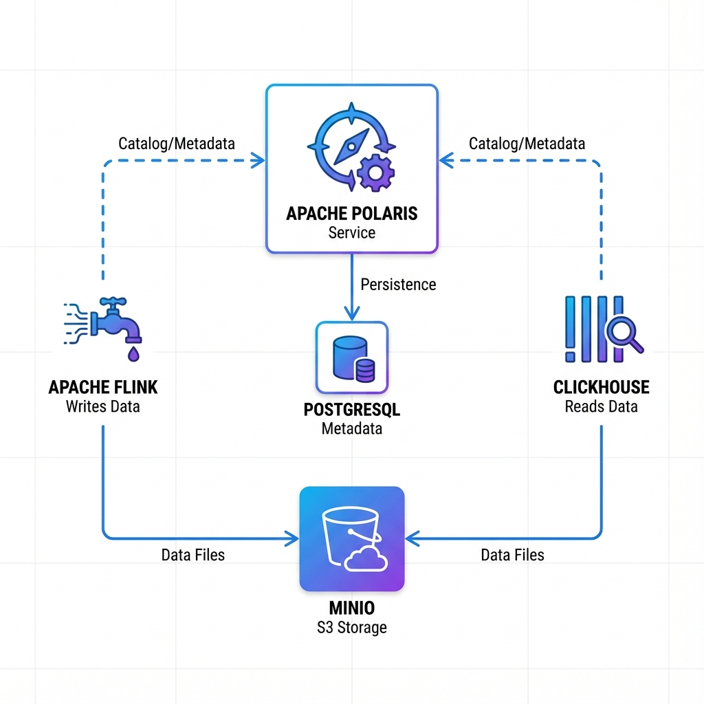
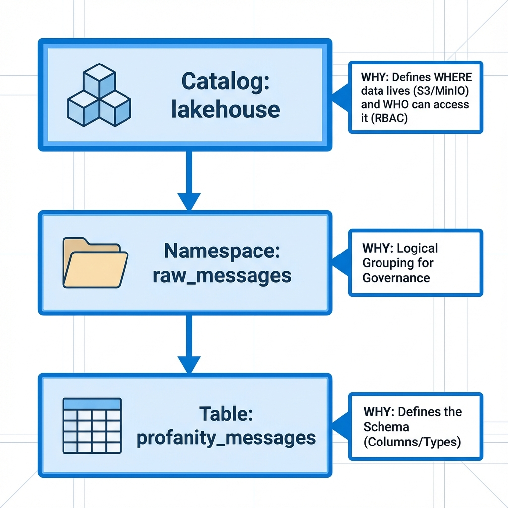
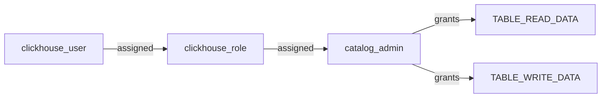
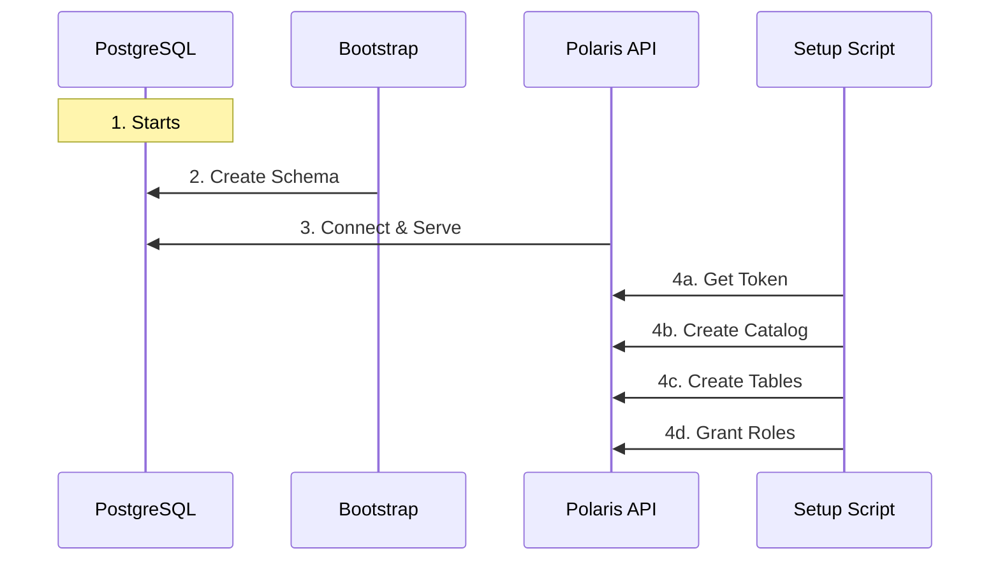

# Apache Polaris Setup - The "Hard Way" Explained

## Table of Contents
1. [Introduction](#introduction)
2. [Project Architecture](#project-architecture)
3. [Why Polaris is Important](#why-polaris-is-important)
4. [The 4-Step Initialization Chain](#the-4-step-initialization-chain)
5. [Deep Dive: Internal Hierarchy & The "Why"](#deep-dive-internal-hierarchy--the-why)
6. [RBAC & Security Model](#rbac--security-model)
7. [Architecture Diagram](#architecture-diagram)

---

## Introduction

If you've looked at the `docker-compose.yml`, you might have wondered: *"Why do I need 4 different containers just to start one catalog service?"*

This article demystifies the **Apache Polaris** setup in this project. We don't just run a "demo mode" container; we orchestrate a **production-grade initialization pipeline** that simulates a real enterprise data platform deployment.

---

## Project Architecture

In your specific setup, **Apache Polaris** acts as the bridge between your stream processing (Flink) and your analytical queries (ClickHouse).

1.  **Breaking the Silo**: Flink writes data to MinIO. Without Polaris, ClickHouse would need to manually scan S3 buckets or rely on brittle file paths to find new parquet files.
2.  **Iceberg Standardization**: Polaris maintains the Iceberg metadata. This ensures that when Flink commits a transaction, ClickHouse immediately sees the consistent snapshot of the table `raw_messages.filtered_messages`.
3.  **Future Proofing**: If you later decide to add Spark for batch processing or Trino for ad-hoc queries, they can simply plug into Polaris and immediately read the same tables without any data migration.

---

## Why Polaris is Important

Apache Polaris serves as the **centralized catalog** for your Data Lakehouse. In a modern architecture separating compute (Flink, Spark, Trino) from storage (S3/MinIO), you need a "brain" to track where data lives and who can access it.

1.  **Unified Governance (RBAC)**: instead of managing permissions in S3 buckets or individual engines, you define roles (e.g., `data_engineer`, `analyst`) in Polaris. It dispenses short-lived tokens to clients, ensuring secure access.
2.  **Interoperability**: It implements the **Iceberg REST Catalog** standard. This means any engine that speaks Iceberg (Flink, Spark, Trino, ClickHouse) can read/write the same data without custom integration.
3.  **Process Isolation**: Compute engines are stateless. You can upgrade Flink or swap ClickHouse without affecting the underlying data or its metadata.
4.  **Cloud Agnostic**: Polaris abstracts the physical storage (S3, Azure Blob, GCS). You can move data between clouds without changing the application logic.

---

## The 4-Step Initialization Chain

We use Docker Compose dependencies (`depends_on`) to strictly order these 4 containers:

### 1. `postgres` (The Brain)
*   **Role**: Stores all metadata (tables, snapshots, roles).
*   **Why**: Polaris is just an API layer; Postgres is where the truth lives.
*   **Status**: Starts empty.

### 2. `polaris-bootstrap` (The Formatter)
*   **Role**: Initializes the database schema.
*   **Why**: A fresh Postgres doesn't have the Polaris tables (`CATALOGS`, `PRINCIPALS`, etc.). This ephemeral container runs the schema migration and creates the initial root credentials.
*   **Lifecycle**: Runs once, then exits (`exit 0`).

### 3. `polaris` (The API Server)
*   **Role**: The actual HTTP server listening on port `8181`.
*   **Why**: This is what Flink and ClickHouse talk to.
*   **State**: When it starts, it serves the API, but **it contains no data**. No catalogs, no tables, just an empty shell.

### 4. `polaris-setup` (The Administrator)
*   **Role**: A script container (`alpine/curl`) that provisions the platform.
*   **Why**: Since Polaris starts empty, we need an automated way to "click the buttons" to set everything up.
*   **Actions**:
    *   Authenticates via OAuth2
    *   Creates the Catalog (`lakehouse`)
    *   Creates Namespaces & Tables
    *   Configures RBAC (Roles & Permissions)

---

## Deep Dive: Internal Hierarchy & The "Why"

This section visualizes the **exact content** your `polaris-setup` container is creating inside Polaris and explains **why** we need each level.

### 1. The Catalog (`lakehouse`)
*   **Why**: Defines **WHERE** data lives.
*   It links the logical world (tables) to the physical world (S3/MinIO).
*   It serves as the root for Role-Based Access Control (RBAC).

### 2. The Namespace (`raw_messages`)
*   **Why**: Logical grouping for governance.
*   Like a folder or a database schema (e.g., `public` in Postgres).
*   Allows you to separate `raw` data from `curated` or `gold` data.

### 3. The Table (`profanity_messages`)
*   **Why**: Defines **WHAT** the data looks like (Schema).
*   Ensures strict typing (e.g., `account_id` is a String, `timestamp` is a Timestamp) so Flink writes valid data and ClickHouse reads valid data.

### The Script's Configuration
Your setup script wires this hierarchy:

*   **Catalog**: `lakehouse`
    *   *Type*: `INTERNAL`
    *   *Base Location*: `s3://lakehouse`
    *   **Namespace**: `raw_messages`
        *   **Table 1**: `profanity_messages` (Schema: `account_id`, `message_body`, `timestamp`...)
        *   **Table 2**: `safe_messages` (Same schema)

---

## RBAC & Security Model

Polaris uses a powerful Role-Based Access Control (RBAC) model. The setup script configures this automatically:

| Principal | Role | Privileges | Used By |
|-----------|------|------------|---------|
| **root** | `data_engineer` | Full Admin | The Setup Script |
| **clickhouse_user** | `catalog_admin` | Read Data | ClickHouse |

### The "Principal Role" Chain

Instead of giving permissions directly to users, we use a chain:

This simulates a real organization where you would grant roles like `DataEng` or `Analyst` rather than direct table access.

---

## Architecture Diagram

We have created a dedicated architecture file: [`polaris_architecture.drawio`](../../polaris_architecture.drawio).

### Setup Workflow

This 4-step dance ensures that when Flink finally starts, it walks into a fully furnished room, ready to work.
