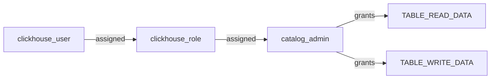
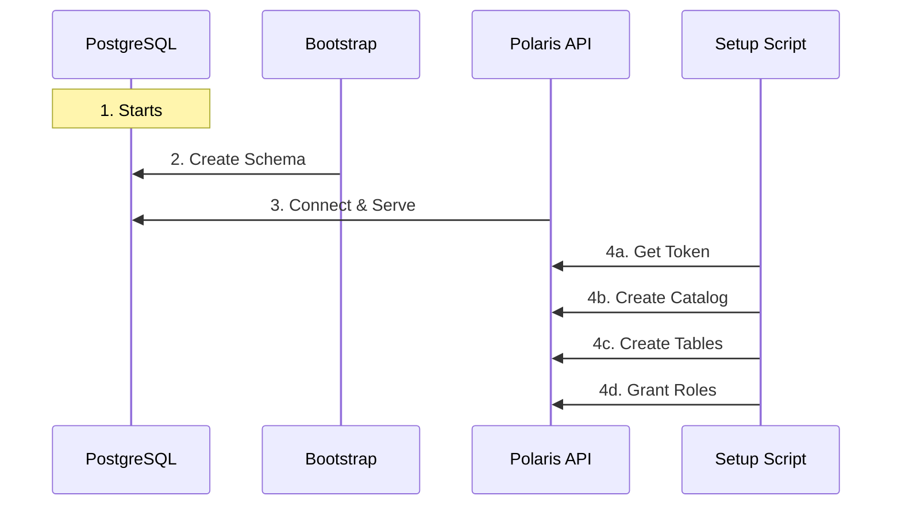

# Apache Polaris Setup - The "Hard Way" Explained

## Table of Contents
1. [Introduction](#introduction)
2. [Why is the Setup So Complex?](#why-is-the-setup-so-complex)
3. [The 4-Step Initialization Chain](#the-4-step-initialization-chain)
4. [Deep Dive: polaris-setup](#deep-dive-polaris-setup)
5. [RBAC & Security Model](#rbac--security-model)
6. [Architecture Diagram](#architecture-diagram)

---

## Introduction

If you've looked at the `docker-compose.yml`, you might have wondered: *"Why do I need 4 different containers just to start one catalog service?"*

This article demystifies the **Apache Polaris** setup in this project. We don't just run a "demo mode" container; we orchestrate a **production-grade initialization pipeline** that simulates a real enterprise data platform deployment.

---

## Why is the Setup So Complex?

In a simple world, a service would just start up and save data to a local file. But Polaris is a **stateless, cloud-native REST Catalog**. It follows the **12-Factor App** methodology:

1.  **Statelessness**: The API server (`polaris`) has no persistent state. It relies entirely on an external database.
2.  **Decoupling**: Storage (MinIO) and Metadata (Postgres) are separate.
3.  **Security First**: It starts "locked down" by default. You must explicitly create credentials and grant permissions.

Because of this, we cannot just "boot and run." We must **provision** the infrastructure.

---

## The 4-Step Initialization Chain

We use Docker Compose dependencies (`depends_on`) to strictly order these 4 containers:

### 1. `postgres` (The Brain)
*   **Role**: Stores all metadata (tables, snapshots, roles).
*   **Why**: Polaris is just an API layer; Postgres is where the truth lives.
*   **Status**: Starts empty.

### 2. `polaris-bootstrap` (The Formatter)
*   **Role**: Initializes the database schema.
*   **Why**: A fresh Postgres doesn't have the Polaris tables (`CATALOGS`, `PRINCIPALS`, etc.). This ephemeral container runs the schema migration and creates the initial root credentials.
*   **Lifecycle**: Runs once, then exits (`exit 0`).

### 3. `polaris` (The API Server)
*   **Role**: The actual HTTP server listening on port `8181`.
*   **Why**: This is what Flink and ClickHouse talk to.
*   **State**: When it starts, it serves the API, but **it contains no data**. No catalogs, no tables, just an empty shell.

### 4. `polaris-setup` (The Administrator)
*   **Role**: A script container (`alpine/curl`) that provisions the platform.
*   **Why**: Since Polaris starts empty, we need an automated way to "click the buttons" to set everything up.
*   **Actions**:
    *   Authenticates via OAuth2
    *   Creates the Catalog (`lakehouse`)
    *   Creates Namespaces & Tables
    *   Configures RBAC (Roles & Permissions)

---

## Deep Dive: polaris-setup

The `polaris-setup` service is a custom shell script that acts as the "Cluster Administrator." Let's break down its key operations:

### A. OAuth2 Authentication
Polaris uses token-based auth. The script first exchanges the root credentials for an access token:

```bash
curl -X POST /api/catalog/v1/oauth/tokens \
  -d "grant_type=client_credentials&client_id=${root}&client_secret=${secret}"
```

### B. Catalog Creation
It defines *where* the data lives. Note the S3 configuration pointing to MinIO:

```json
{
  "catalog": {
    "name": "lakehouse",
    "type": "INTERNAL",
    "properties": {
      "default-base-location": "s3://lakehouse"
    },
    "storageConfigInfo": {
      "storageType": "S3",
      "endpoint": "http://minio:9000"
    }
  }
}
```

### C. Table Registration
It creates the `profanity_messages` and `safe_messages` tables with their specific schema and partition specs. This ensures Flink has a strict contract to write against.

---

## RBAC & Security Model

Polaris uses a powerful Role-Based Access Control (RBAC) model. The setup script configures this automatically:

| Principal | Role | Privileges | Used By |
|-----------|------|------------|---------|
| **root** | `data_engineer` | Full Admin | The Setup Script |
| **clickhouse_user** | `catalog_admin` | Read Data | ClickHouse |

### The "Principal Role" Chain

Instead of giving permissions directly to users, we use a chain:



This simulates a real organization where you would grant roles like `DataEng` or `Analyst` rather than direct table access.

---

## Architecture Diagram

We have created a dedicated architecture file: [`polaris_architecture.drawio`](../../polaris_architecture.drawio).

### Setup Workflow



This 4-step dance ensures that when Flink finally starts, it walks into a fully furnished room, ready to work.
